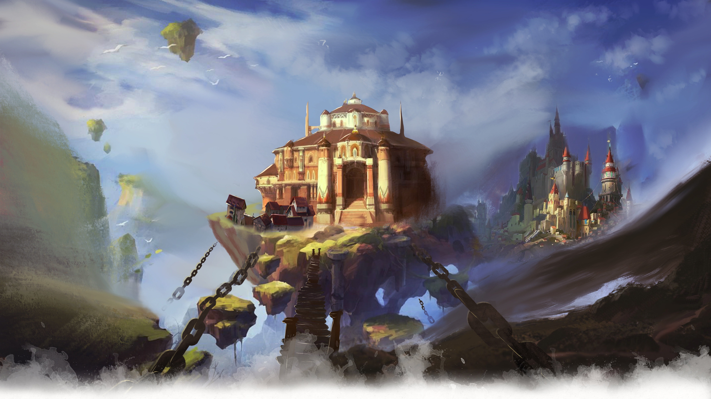
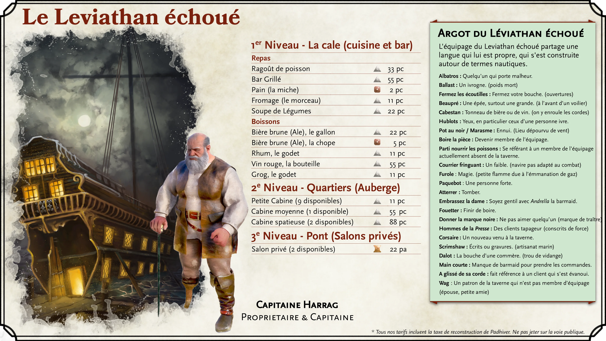
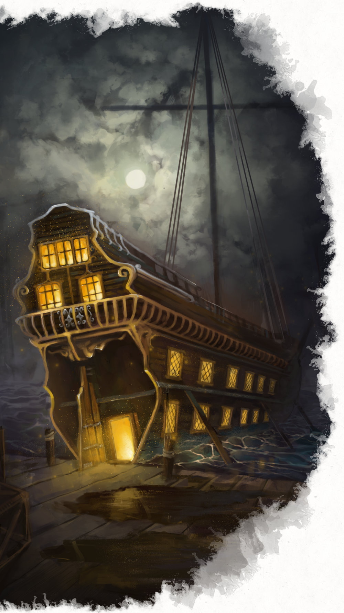
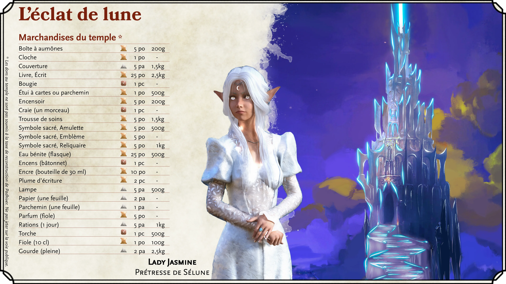
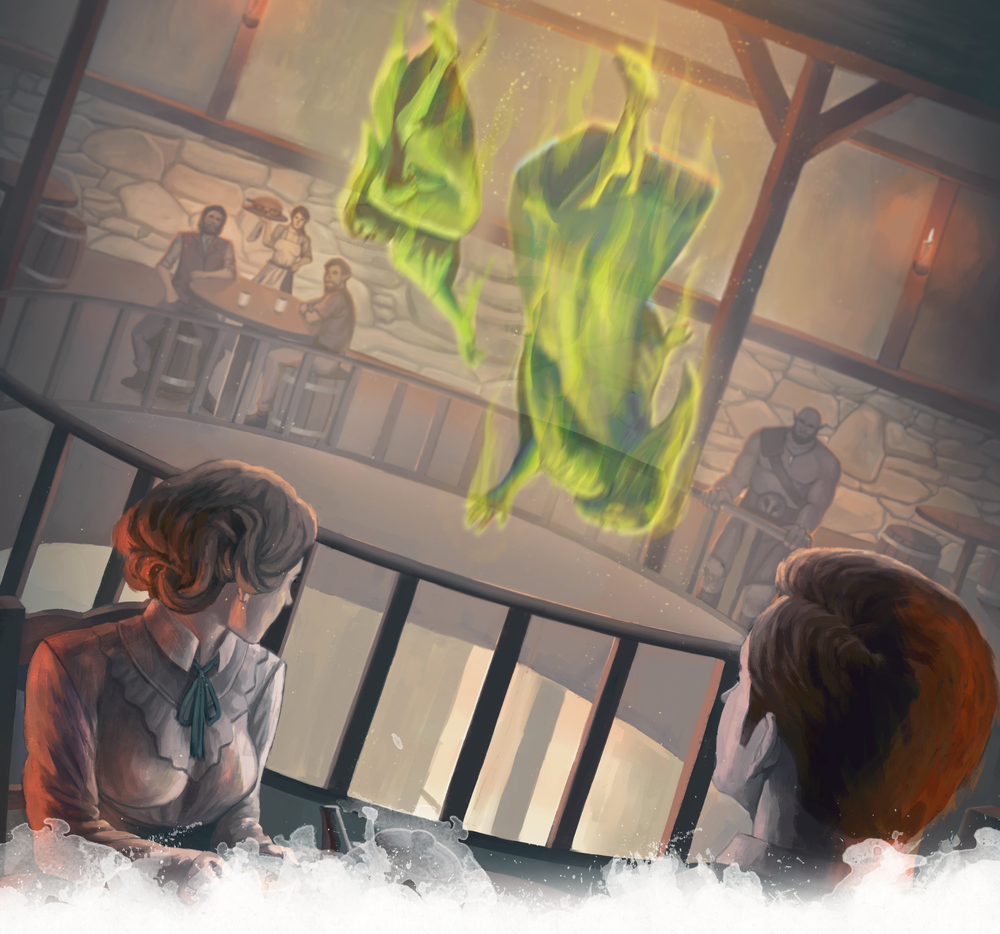
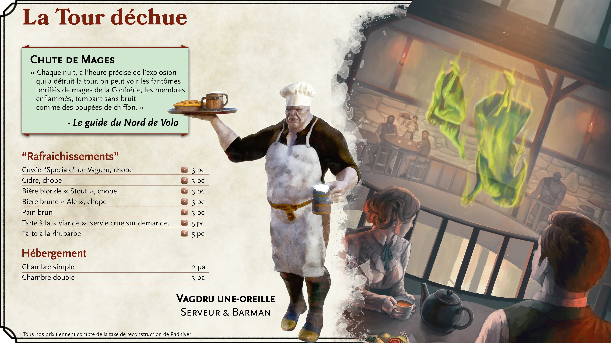

# Lieux importants de Padhiver [Neverwinter]

## Castel-Nièvre [Castle Never]

{.print-only .print-top-right}

Le Castel-Nièvre, dominant l’extrémité ouest de la ville, est incontournable. Ce château se trouve sur les falaises rocheuses et les affleurements du côté nord de l’estuaire où la rivière Padhiver et la mer des épées se rencontrent. Le château est construit sur un rocher circulaire duquel trois ponts rayonnent sur la rivière Padhiver : le pont du dragon endormi, le pont de la wyverne ailée et le pont du dauphin.

Le château chevauche les frontières entre l’Enclave des Protecteurs, les Docks de Padhiver et le quartier de Bluelake. Au cours de l’histoire, Castel-Nièvre a été revendiqué comme faisant partie de nombreux quartiers de la ville, mais il serait peut-être préférable de considérer le château comme son propre quartier. Les trois ponts autour du château constituent une partie essentielle de l’infrastructure de la ville, offrant un moyen de traverser la rivière Padhiver et de se rendre entre les quartiers de l’Enclave des Protecteurs et Bluelake.

La structure intérieure et extérieure du château est actuellement en mauvais état, ce qui le rend trop dangereux pour toute habitation. L’actuel chef de facto de la ville, *Lord Dagult Longuebraise*, fait des incursions dans la restauration de Castel-Nièvre.

#### Castel-Nièvre : Ascension et chute

Un visiteur de Padhiver peut noter que son architecture diffère un peu de celle des autres parties de la ville. En effet, Castel-Nièvre a en fait plus d’un millénaire, ayant été commandé par l’elfe du soleil, *Lord Halueth Never*, célèbre pour avoir conquis la ville d’Illusk (dont les ruines se trouvent maintenant sous Luskan). Une grande partie de Castel-Nièvre a vraisemblablement été construite entre -10 DR (la conquête d’Illusk par *Lord Never*) et 87 DR (l’époque où Padhiver a été officiellement fondée en tant que ville).

Tout au long des nombreuses attaques et catastrophes de Padhiver, Castel-Nièvre s’est imposé comme un symbole imposant de la détermination de la ville ainsi qu’un monument aux gloires passées. Cela ne veut pas dire, cependant, que le château a été laissé indemne. La catastrophe la plus importante pour Castel-Nièvre fut peut-être en 1451 DR lorsque "[le cataclysme](history-of-neverwinter)" frappa Padhiver et laissa la majeure partie de Castel-Nièvre en ruines et tua presque tous ses habitants (y compris la lignée des dirigeants). Castel-Nièvre reste aujourd’hui hanté par les esprits des victimes du cataclysme.

(print-page)

#### L’intérieur du château

Explorer l’intérieur de Castel-Nièvre est actuellement une activité périlleuse. Les aventuriers cherchant à naviguer dans le château le trouveraient inhospitalier en raison à la fois de ses habitants fantomatiques et des simples dangers liés à l’exploration d’un bâtiment si gravement endommagé. Le château est une structure massive avec d’innombrables étages qui montent vers le ciel et descendent vers les profondeurs. Il a un certain nombre de zones de danger bien documentées :
- ***L’Atrium***. L’atrium, maintenant barricadé pour empêcher la lumière du soleil d’entrer et la chaleur de la pourriture de sortir, contient une étrange exposition de squelettes d’oiseaux exotiques dans des cages dorées. L’atrium abrite désormais des [Myconids](/monster/myconid-adult) territoriaux qui attaqueront et se régaleront d’intrus.
- ***Galerie des Glaces***. Auparavant une longue salle des miroirs où la noblesse pratiquait la démarche et la posture, tout intrus mortel qui entre dans cette salle trouvera une recréation magique de la destruction de la salle. Des éclats de verre miroir volant et des ruines enflammées seront lancés sur tous ceux qui restent trop longtemps dans le hall.
- ***Padessous***. Les catacombes sous le château, appelées "Padessous [Neverneath]", présentent un enchantement qui fait changer dynamiquement la disposition en forme de labyrinthe avec une certaine malveillance. Les structures changeront pour créer des impasses, des tunnels qui ramènent sur eux-mêmes ou des portes qui mènent à de nouveaux emplacements à chaque fois qu’elles sont ouvertes. Tout cela sert à piéger les aventuriers jusqu’à ce qu’ils rencontrent leur mort, probablement sous les griffes des nombreuses [gargouilles](/monster/gargoyle) des catacombes.
- ***La Voûte des Neuf***. Ce tombeau est le lieu de repos des neuf gardes du corps de la lignée royale de Padhiver. La voûte contient une chambre extérieure qui comporte des torches éternelles qui éclairent la pièce lorsque les mortels entrent. Les morts-vivants se cachent dans l’ombre de cette chambre extérieure. La chambre intérieure, scellée derrière une porte en pierre géante portant le sceau de Padhiver, possède neuf cercueils en marbre qui encerclent un trône. Les visiteurs qui parviennent à se rendre dans la chambre intérieure de la Voûte des Neuf et à se reposer peuvent se réveiller pour trouver les esprits des Neuf qui veillent sur eux.

(print-column)

#### La restauration de Castel-Nièvre

*Seigneur Dagult Longuebraise* a fait de la restauration de Castel-Nièvre une priorité de la ville. Il s’agit d’une entreprise colossale qui prendra probablement des années, voire des décennies. *Longuebraise* voit dans cette entreprise une poursuite symbolique de la restauration de la ville.

Malheureusement, l’une des premières parties du château qui *a été* restaurée pour un usage fonctionnel sont ses donjons. *Longuebraise* a ordonné que les personnes de Padhiver reconnues coupables de crimes graves soient placées dans les donjons du château, appelés "Les Trous" par les habitants. Les exécutions ont lieu tous les jours, à midi, dans Les Trous - généralement deux jours après l’envoi du prisonnier aux Trous.

|**Inspiration pour le Maître du Donjon**|
|---|
|***Marchands meurtriers***. La restauration de Castel-Nièvre s’est faite au prix d’une fiscalité élevée pour la population de Padhiver. Cela a bouleversé certains marchands puissants avec des poches profondes et une compagnie peu recommandable. *Lord Dagult Longuebraise* sait que des tentatives d’assassinat sont probables et charge le groupe de sa protection et de l’élimination de ses assassins potentiels.|
|***Reliques sentimentales***. Un noble de Padhiver maintenant âgé a perdu un être cher dans la destruction du château il y a près d’un demi-siècle. Le noble âgé charge le groupe d’entrer dans le château en ruine pour récupérer une relique sentimentale du corps de leur amant perdu.|
|***Construction bloquée***. Les équipages supervisant la restauration du château savent que les fantômes et autres monstres devront être éliminés du château. *Lord Longuebraise* a engagé des guerriers et des mages pour les aider. Cependant, la construction s’est arrêtée car l’équipage a trouvé une barrière magique qu’ils ne peuvent pas franchir. Le groupe doit rechercher un moyen de relancer la construction.|
{.dmidea}

|**En savoir plus**|
|---|
|*Acquisitions Incorporated*, p. 121 - 122, (5th Edition)|
|*Guide des aventuriers de la côte des Épées*, p. 51, (5th Edition)|
|*Neverwinter Campaign Setting*, p. 148 - 149, (4th Edition)|
|*Grand History of the Realms*, p. 59, 61, (3rd Edition)|
|*The North - Guide to the Savage Frontier - Cities and Civilizations*, p. 16 (2nd Edition)|
|*Volo’s Guide to the North*, p. 134 (2nd Edition)|
{.references}

(print-page)

## Enclave du Protecteur [Protector’s Enclave]

### Le palais de justice [Hall of Justice]

Le palais de justice est aussi le temple principal de *Tyr*, dieu de la loi et de la justice. Les grands murs de pierre de la salle, ses imposants piliers et son haut toit en dôme en font une structure impressionnante et intimidante. Son intérieur est également assez grand pour abriter de grandes races telles que des géants et des dragons.

Bien plus qu’un simple temple à une divinité, le palais de justice faisait office de tribunal de la ville pour les affaires mineures (c’est-à-dire excluant les crimes où l’accusé était de naissance noble, sans citoyenneté ou accusé de meurtre). Il servait également de terrain d’exercice et d’entraînement à l’armement discipliné pour les fidèles qui défendaient le temple et ce qu’il représentait. Les fonctions de la salle ont en grande partie cessé avec la mort de Tyr à la fin des années 1300 DR.

Même après la mort de *Tyr*, les habitants de Padhiver ont refusé de réutiliser le temple pour vénérer d’autres divinités. Lorsque *Lord Longuebraise* est arrivé dans la ville, il y a installé un sacerdoce temporaire de Torm, estimant qu’il y avait des similitudes dans les principes religieux. Il a également utilisé le temple comme base pour ses opérations dans la ville, ainsi que comme résidence personnelle. Ces deux actions ont rencontré la désapprobation des habitants de la ville.

Avec la récente résurrection de *Tyr*, le temple lui a été reconsacré, et *Lord Longuebraise* habite maintenant une villa privée. La restauration du palais a été très appréciée par les citoyens de Padhiver et a beaucoup contribué à améliorer l’estime de *Lord Longuebraise* auprès des habitants. Avec le retour du palais de justice à son ancienne gloire, il sert à nouveau de point central, à la fois dans l’emplacement physique et dans l’esprit, de l’Enclave du Protecteur.

|**En savoir plus**|
|---|
|*Guide des aventuriers de la côte des Épées*, p. 51, (5th Edition)|
|*Neverwinter Campaign Setting*, p. 140 - 141, (4th Edition)|
|*Volo’s Guide to the North*, p. 133 (2nd Edition)|
{.references}

### La Maison du Savoir

Cette maison [House of Knowledge] est à la fois une bibliothèque et le temple principal d’*Oghma* dans la ville de Padhiver. Sur le plan architectural, elle est considérée comme l’une des structures les plus impressionnantes et les plus belles de la ville - avec de nombreuses fenêtres et un impressionnant toit voûté. Ses vastes rayonnages contiennent plusieurs siècles d’ouvrages et documents précieux, y compris la paperasse gouvernementale récente, car la ville n’a pas de siège officiel du gouvernement à l’heure actuelle.

Comme une grande partie de Padhiver, la Maison du Savoir a subi une destruction quasi totale avec l’éruption du Mont Hautchaud en 1451 CV. Un jeune maître du savoir dévoué, *Atlavast*, a sauvé une grande partie du précieux contenu de la bibliothèque en scellant le sanctuaire intérieur du temple et en se piégeant à l’intérieur. Seul et dans la solitude, *Atlavast* a réussi à survivre au cataclysme et à sauver des multitudes de tomes, documents et artefacts rares. Cependant, il est rapidement devenu reclus et l’isolement l’a rendu un peu fou. Il a passé son temps à cataloguer et à réorganiser à plusieurs reprises la bibliothèque. Il est devenu extrêmement protecteur de ce contenu. Pendant ce temps, les sections extérieures de la Maison de la Connaissance ont été prises en charge par divers squatters, y compris des cultistes Ashmadai adorateurs du démon.

Depuis le scellement du gouffre, les fidèles d’Oghma sont retournés au temple et travaillent à le restaurer en tant que centre de connaissance et d’apprentissage. Le sévère Grand Scribe *Spivey Liethennson* supervise désormais la reconstruction de la Maison avec une poigne de fer et un tempérament colérique. L’extérieur de la Maison de la Connaissance a déjà été en grande partie restauré, bien que de nombreux travaux restent en cours à l’intérieur. Pourtant, la maison est redevenue un lieu fonctionnel pour ceux qui recherchent des traditions et des archives locales.

|**Inspiration pour le Maître du Donjon**|
|---|
|***Informations gênantes***. Les joueurs à la recherche de connaissances spécifiques sur Padhiver ou la région environnante seraient avisés de considérer la vaste richesse d’informations stockées à la Maison de la Connaissance. Cependant, pour accéder à certaines connaissances, le groupe devra peut-être faire face à l’irritable *Grand Scribe Liethennson* ou au comportement fêlé et surprotecteur du Maître du savoir *Atlavast*. L’un ou l’autre peut faire en sorte que le groupe fasse ses preuves d’une manière ou d’une autre avant de se voir confier le contenu de la bibliothèque.|
{.dmidea}

|**En savoir plus**|
|---|
|*Guide des aventuriers de la côte des Épées*, p. 51, (5e Édition)|
|*Acquisitions Incorporated*, p. 122, (5th Edition)|
|*Neverwinter Campaign Setting*, p. 144 - 145, (4th Edition)|
|*The North - Guide to the Savage Frontier - Cities and Civilizations*, p. 16 (2nd Edition)|
{.references}

(print-page)

{.size-cover .no-margin .print-only}

## Les Terres flottantes [Floating Earthmotes]

L’une des caractéristiques les plus enchanteresses de la ville de Padhiver est ses trois grandes terres flottantes. La Magepeste de 1385 CV a provoqué le soulèvement de morceaux de Padhiver (ainsi que d’autres zones de toute la planète Toril) qui ont commencé à flotter. Les habitants industrieux de Padhiver ont pu attacher quelques-unes de ces mottes de terre avec des cordes et les empêcher de s’envoler vers la Côte des épées.

{.size-full .screen-only .before-next-page-header}

### Le Masque de Pierre-lune [Moonstone Mask]

Le Masque de Pierre-lune est une grande auberge qui se trouve sur une terre flottante reliée aux quais de l’Enclave du Protecteur. Il est considéré par beaucoup comme l’auberge la plus raffinée et la plus luxueuse de Padhiver. Le lieu porte le nom des demi-masques portés par tout son personnel, qui sont bordés de pierres de lune incandescentes.

(print-column)

#### Le personnel du Masque

On pourrait supposer que les chambres impeccables et la vue incomparable du Masque de Pierre-lune sont ce qui attire ses clients, mais c’est en fait le personnel du Masque qui est le principal attrait de l’auberge. Les membres du personnel sont formés pour être des compagnons qualifiés ainsi que des confidents amicaux et loyaux. Ils offrent une conversation érudite et sont compétents dans une grande variété de jeux. C’est cette compagnie qui a fait du Masque de Pierre-lune une destination de choix pour les personnes riches et de haut rang depuis plus d’un siècle.

{.print-bottom-right .with-margin}

(print-page)

Bien que le Masque de Pierre-lune n’emploie plus uniquement des femmes, tous les employés en contact avec la clientèle sont exceptionnellement attrayants. Les employés sont tous vêtus de noir, chacun portant également les masques éponymes de l’auberge et une amulette. Cependant, ces vêtements ne sont pas de simples uniformes. Les masques fournissent au porteur les capacités de Vision dans le noir, permettant à tout le personnel de traverser gracieusement les zones sombres ou ténébreuses de l’auberge. Les amulettes, également magiques, offrent au personnel une immunité contre la lecture de l’esprit ou le contrôle mental - une qualité importante compte tenu de la quantité d’informations sensibles confiées aux compagnons de l’auberge. Les amulettes permettent également une communication magique avec le propriétaire de l’auberge en utilisant uniquement la télépathie - une caractéristique de sécurité importante si un employé rencontrait un jour un invité indiscipliné ou peu recommandable.

La propriétaire actuelle du Masque de Pierre-lune est *Liset Cheldar*, une femme demi-elfe. On dit qu’elle est la descendante de l’ancien propriétaire du Masque, *Ophala Cheldarstorn*. Contrairement à *Ophala*, qui était un mage puissant, *Liset* ne semble pas posséder de tels pouvoirs. Elle est sympathique et connue pour flirter avec les invités.

#### Les commodités du Masque

L’auberge dispose d’une grande salle à manger chaleureuse au rez-de-chaussée. La pièce sert également de salon confortable avec un impressionnant foyer. Le reste du rez-de-chaussée est occupé par des cuisines dédiées à la préparation de la cuisine gastronomique pour les nombreux hôtes de l’auberge. Un grand escalier en colimaçon mène de la salle à manger aux chambres d’hôtes au-dessus. L’atmosphère de la salle à manger est généralement détendue avec des conversations polies partout.

Les chambres occupent 3 étages. Elles varient en taille, des studios à un lit aux grandes suites aux étages supérieurs. Toutes disposent de lits confortables et de tapis de fourrure somptueux. Les clients séjournant dans les chambres de l’auberge peuvent s’attendre à ce que les repas soient inclus dans le prix de leur séjour, mais l’alcool peut coûter plus cher. Naturellement, le Masque propose une sélection impressionnante de boissons raffinées.

Pour les invités voyageant par les moyens les plus élaborés, le toit comporte un palier spécial pour les coursiers ailés. On dit que le masque est chargé de panneaux muraux cachés qui peuvent s’ouvrir pour un voyage secret à l’intérieur de l’auberge elle-même. On dit que le personnel ouvre ces panneaux en prononçant certains mots magiques. Le 4e étage, juste en dessous des suites penthouse, abrite une salle des fêtes animée avec de la musique et de la danse. Une insonorisation magique garantit que cela ne dérangera aucun des invités.

|**Inspiration pour le Maître du Donjon**|
|---|
|***Base de connaissances***. *Liset* et les autres membres du Masque de Pierre-lune détiennent une mine d’informations et de rumeurs sur la ville. Ils ne divulgueraient jamais d’informations confidentielles sur l’un de leurs clients, mais ils pourraient informer les aventuriers d’événements et de rumeurs non confidentiels.|
|***Bonne compagnie***. Il ne serait pas rare ou surprenant de trouver des personnalités notables au Masque de Pierre de Lune, dont *Lord Dagult Longuebraise* lui-même. Utilisez cet emplacement comme lieu de rencontre notable.|
|***Babioles au sous-sol***. Si les joueurs ont pu se faufiler dans les différentes salles de stockage du sous-sol du Mask sans se faire prendre, ils pourraient trouver toutes sortes d’objets magiques.|
{.dmidea}

 **Liset Cheldar**, propriétaire & aubergiste

(print-page)

#### L’histoire du Masque de Pierre-lune

Le Masque a été construit par *Ophala Cheldarstorn*, mage et membre de l’Ordre des capes aux milles étoiles. *Ophala* a également créé les masques magiques et les amulettes portés par le personnel. Avant que le batiment ne flotte au-dessus de Padhiver, la rumeur disait qu’il comportait des entrées secrètes où des invités spéciaux pouvaient aller et venir discrètement. On disait aussi que des sous-sols le reliaient aux tunnels des zones tenues par les nains de l’Outreterre.

Au milieu des années 1400 DR, l’éruption du mont Hautchaud a cassé les cordes qui l'ammaraient au sol. Elle a ainsi dérivé pendant des mois au-dessus de la mer des épées avant qu'on l'ammare à nouveau via de grandes chaînes solides. Même après le retour du Masque à Padhiver, le manque de clients l'obligea à fermer pendant quelques décennies. Lorsque *Lord Longuebraise* a lancé son mouvement "Nouveau Padhiver" pour la reconstruction de la ville, *Liset Cheldar* a pu non seulement convaincre *Longuebraise* qu’elle était l’héritière légitime du Masque, mais aussi de l’aider à financer la restauration de l’auberge, lui redonnant sa gloire d'antant. En guise de remboursement, l’auberge servit souvent à loger *Longuebraise* et plusieurs de ses mercenaires et officiers tout au long des années 1470 et 1480 DR.

|**En savoir plus**|
|---|
|*Neverwinter Campaign Setting*, p. 142 - 143, (4th Edition)|
|*Storm Over Padhiver*, p. 8 - 11 (4th Edition)|
|*Volo’s Guide to the North*, p. 138 - 140 (2nd Edition)|
|*The North - Guide to the Savage Frontier - Cities and Civilizations*, p. 16 - 17 (2nd Edition)|
{.references}

### Fort aérien des pirates [Pirates’ Skyhold]

Au nord-ouest de Padhiver, près de la côte, se trouve une autre terre flottante appelée "le fort aérien des pirates". Peu de temps après la Magepeste, certains pirates de la région ont noté qu’une terre flottante pouvait servir de base défendable sur les côtes qu’ils parcouraient. Alors en possession d’un vaisseau spatial, ils ont revendiqué cette terre comme étant la leur et y ont construit de modestes fortifications en bois.

Une mystérieuse tragédie s’est abattue sur le fort qui a laissé la plupart, sinon la totalité, de ses habitants pirates morts ou disparus. Leur vaisseau spatial reste amarré sur la terre flottante comme un étrange rappel de son abandon. Personne ne sait exactement ce qui s’est passé, mais des dizaines de rumeurs circulent à Padhiver. Certains prétendent qu’un dragon s’est emparé de la forteresse, d’autres prétendent qu’il est habité par des Netherisses, tandis que d’autres encore prétendent qu’il est hanté par toutes sortes de fantômes.

On dit aussi qu’un trésor caché existe toujours sur l’île. Les pirates auraient entreposé leur butin dans la forteresse, et compte tenu de leur disparition soudaine, on pense que le trésor doit sûrement encore se trouver quelque part. Cependant, se rendre à la forteresse n’est pas une mince affaire. Une forme de transport aérien ou magique devra être achetée pour accéder à la zone.

|**Inspiration pour le maître du donjon**|
|---|
|***Un livre ouvert***. Dans la 4e édition, le fort aérien a intentionnellement été laissé mystérieux et ouvert aux Maîtres de Donjon pour créer leurs propres aventures.|
|***Trésor du Dragon***. C’est bien connu, les dragons adorent un bon trésor ! Un jeune dragon a peut-être attaqué le Fort céleste, tué tous les habitants et s'est attribué le butin des pirates.|
|***Pirates zombies [niv. 9-11]***. Le dieu de la mort, *Myrkul*, a été très actif dans la région (voir la trilogie [Le dragon de la Flèche de Givre](https://www.dndbeyond.com/sources/doip) et [Au delà du dragon de la Flèche de Givre](https://www.dndbeyond.com/essentials/continue-the-adventure). Les morts-vivants ont envahi le Fort Céleste et l’ont transformé en un fort des damnés. Le Death Knight-Dreadnaught est étrangement ancré sous la terre flottante.|
|***J'en prendrai un de chaque***. Myrkul a envoyé un [Dracoliche](/monster/adult-blue-dracolich) ou [Dragon Fantôme](/monster/ghost-dragon) au Fort Céleste, où il repose sur le butin des pirates entouré de son armée de pirates morts-vivants !|
{.dmidea}

|**En savoir plus**|
|---|
|1 - *Neverwinter Campaign Setting*, p. 148, (4th Edition)|
{.references}

### Le Flotteur des pêcheurs [Fisher’s Float]

Le Flotteur des pêcheurs est une terre flottante juste au sud-ouest de Padhiver où une chaleureuse guilde de pêcheurs a fait sa maison et son siège social. Les maisons et les entrepôts visibles sur la terre flottante sont austères à tous points de vue. Les petites cabanes en bois impliquent certainement que les pêcheurs et les marins qui habitent le Flotteur n’ont pas un style de vie indulgent.

Alors que ces pêcheurs fournissent pacifiquement une grande partie des fruits de mer de Padhiver, ils parviennent également à en garder une grande partie pour eux. En conséquence, il existe de nombreuses rumeurs sur le Flotteur des pêcheurs. Une rumeur particulièrement répandue est que ses habitants ont sous une forme ou une autre fait allégeance à des dieux marins maléfiques et/ou à des monstres marins.

|**En savoir plus**|
|---|
|*Neverwinter Campaign Setting*, p. 148, (4th Edition)|
{.references}

(print-page-single-column)

## Quartier des quais

{.size-full .screen-only .before-next-page-header}

### Le Léviathan échoué

Le Léviathan était un infâme navire pirate qui rôdait le long de la Côte des épées, semant la terreur sur ceux qui croisaient son chemin. Le capitaine du Léviathan, *Harrag*, était un défi redoutable pour tous ceux qui le rencontraient en mer, et aucun marin ne sentait son trésor en sécurité pendant qu’*Harrag* chassait sur la mer des épées. Quelque temps après l’éruption du mont Hautchaud, le Léviathan s’est échoué dans le nord de Padhiver et a percé sa coque. Plutôt que d’abandonner son navire, *Harrag* est resté avec lui pendant que les quais de la ville étaient reconstruits autour du navire (dans le cadre des efforts de reconstruction générale de l’époque). *Harrag* a supervisé la conversion de l’épave en une auberge et une taverne prospères.

{.image-beached-leviathan}

#### Marcher sur les planches

Le navire est divisé en trois niveaux pour les invités. Le premier niveau ("la cale"), accessible depuis les quais, abrite la cuisine et la taverne du Léviathan échoué. La taverne dispose d’un grand nombre de tables adaptées aux fêtes de toutes tailles. Le deuxième niveau (« les quartiers ») abrite une auberge avec 12 chambres de différentes tailles à louer, et le troisième niveau (« la terrasse ») comprend des salons privés et des tables qui peuvent être louées à un prix plus élevé. Au sommet du "pont" se trouve une cabine supérieure supplémentaire qui sert de quartier privé au *capitaine Harrag*. Les différents niveaux des ponts sont accessibles par un petit escalier en colimaçon au centre du navire. De plus, un ascenseur actionné par poulie peut transporter des marchandises entre chacun des niveaux via un petit puits qui s’étend à travers chacun des niveaux.

L’ensemble du navire est décoré d’accessoires à thème nautique, dont beaucoup sont des trophées des conquêtes passées d’*Harrag*. L’intérieur du navire et son ameublement sont bien conçus, avec des boiseries en chêne et en cerisier. Cependant, des années de clients qui vont, viennent et se bagarrent ont laissé l’intérieur finement travaillé bien usé.

#### Grog et gangs

La clientèle du Léviathan échoué est généralement un groupe humble et mixte. Tous ceux qui ont de la monnaie à dépenser sont les bienvenus à la taverne. Les clients habituels comprennent autant de marins que de résidents plus terrestres de Padhiver. Le personnel et les clients utilisent fréquemment l’argot nautique dans la taverne (par exemple, se référer à un ivrogne comme "lest" ou appeler un nouveau venu un "corsaire"). Il est très courant que les visiteurs terriens se sentent un peu perdus lorsqu’il s’agit d’analyser le dialecte des marins. Les jeux de hasard et les bagarres sont fréquents, bien que ces derniers soient susceptibles de vous faire rapidement expulser du navire.

Il est également extrêmement courant de trouver un certain nombre de factions minables représentées au Léviathan échoué. On voit couramment à la taverne des contrebandiers, des voleurs et des gangs de presse. Pour ces acabits, le Léviathan échoué sert de lieu d’affaires important. Des affaires sont conclues, des échanges sont effectués et le marin ivre occasionnel est réduit en esclavage. Tout cela est relativement bien connu de *Lord Longuebraise* et de ses forces, qui surveillent souvent discrètement la taverne pour se tenir au courant des dessous miteux de la ville. *Longuebraise* et sa montre, cependant, n’interviennent presque jamais dans ces magouilles, choisissant plutôt de garder la taverne comme source d’information fiable.

(print-page)

#### Fidèles compagnons de bord

Un établissement comme le Léviathan échoué ne pourrait exister sans un capitaine intrépide et un équipage chaleureux pour le seconder. Le Léviathan échoué a une collection colorée de personnel et d’habitués qui font de l’endroit un lieu si intéressant. Devenir un habitué de la taverne est susceptible de vous valoir un surnom approprié sur le thème nautique.

***Capitaine Harrag.*** *Le Capitaine Harrag* est un homme costaud et poilu avec une seule jambe (il a perdu l’autre dans un combat avec un sahuagin). Il a un extérieur effrayant et bourru, mais ceux qui le connaissent le mieux savent que l’homme possède une quantité impressionnante de compassion et d’empathie. Le Léviathan échoué est un véritable travail d’amour pour le capitaine, et il tire une immense fierté de l’établissement. Cela dit, *Harrag* n’est pas un enfant de cœur. Il n’hésitera pas à conclure de bonnes affaires pour son entreprise, même si la tactique exige qu’il soit impitoyable. De même, ceux qui menacent l’établissement seront traités rapidement et fermement.

 **Harrag**, propriétaire & capitaine

(print-column)
##### Personnel ("Équipage")

***Andrella.*** "Camarade" - *Andrella* est le bras droit de Harrag. Une humaine d’âge moyen, elle est la barmaid principale (*Jyseria*, *Sandrine* et *Willow* étant les autres barmaids). Elle dirige le personnel quand *Harrag* n’est pas là et se soucie très profondément de lui. Elle a développé une sorte d’amour secret et non partagé pour le capitaine.

***Feng.*** Un très grand mâle demi-orc, *Feng* sert de videur de la taverne.

***Tabnab.*** Un homme bizarre, *Tabnab* est le cuisinier de l’auberge.

##### Habitués

***Len-jes.*** "Capitaine de port" - *Len-jes*, une genasi de l’eau cicatrisée, est en fait la capitaine du port de Padhiver. Elle loue une chambre au Léviathan échoué de manière semi-régulière.

***Umi.*** "Barreuse" - *Umi*, également une femme genasi de l’eau, est la cousine de *Len-jes* et sert de remplaçante à *Feng* si une situation à la taverne devient trop tapageuse. Elle est très habile avec l’épée.

***Bobrik Haut-manteau.*** "Maître d’équipage" - *Bobrik*, un nain mâle corpulent avec un singe de compagnie, est un habitué du bar. Il a un tempérament fougueux qui le fait parfois expulser de la taverne pendant quelques jours.

***Markul.*** "Vigie" - *Markul*, un jeune humain, écoute constamment tout ce qui se passe à la taverne. Pour le juste prix, il est prêt à partager les secrets qu’il a appris, tant qu’il ne s’agit pas de secrets qui, selon lui, nuiraient au Léviathan.

***Ettain.*** "Calfateur" - *Ettain*, un homme demi-elfe, travaille comme bricoleur du navire. C’est un charpentier qualifié qui peut réparer le navire ainsi que fabriquer ou réparer ses meubles en cas de besoin. Il connaît chaque centimètre carré du navire, y compris ses secrets.

***Korin.*** "Chanteur" - Korin, un barde draconique d’âge moyen, joue de la musique et chante à la taverne. Il est souvent connu pour faire chanter tout le bar des chants de marins et des chansons folkloriques. Il accepte volontiers les pourboires et les boissons. Sa famille a été massacrée par des cultistes, qu’il transformera parfois en un chant funèbre chargé de chagrin.

(print-page)

#### Eaux troubles

Tout au long de son histoire relativement brève à Padhiver, le Léviathan échoué s’est retrouvé mêlé à des conflits malgrès son humilité apparente. C’est en grande partie à cause du type de patronage autorisé dans le Léviathan, en plus de la propre implication de *Lord Longuebraise* dans la région. C’est avec le soutien et le patronage du *Seigneur Protecteur* que *Harrag* a pu créer l’établissement - car *Longuebraise* a effacé le dossier de ses nombreux crimes en haute mer. Cela a fait de du capitaine un véritable loyaliste à *Longuebraise*, qui utilise *Harrag* pour ses propres ambitions. *Longuebraise* est même allé jusqu’à transformer l’ombre de *Harrag* en une créature utilisée pour espionner l’établissement.

En 1479, dans le cadre de la bagarre autour du véritable héritier du trône de Padhiver et de la couronne perdue d’Alagondar, le Léviathan fut attaqué par des membres furieux de Padhiver. Le Léviathan ne fut sauvé que grâce à l’intervention d’aventuriers et du général en chef de *Longuebraise*, le *général Sabine*. Plus tard, cette même année, des cultistes et des démons Ashmadai infiltrèrent le Léviathan échoué et tuèrent l’un des principaux conseillers du *général Sabine*. Cela faisait finalement partie d’un complot plus vaste mené par un puissant mage nommé *Elden Vargas* pour utiliser les pouvoirs d’Asmodeus à ses propres fins.

|**En savoir plus**|
|---|
|*Dungeon*, Issue #193, p. 79 -83, (4th Edition)|
|*Neverwinter Campaign Setting*, p. 154-155, (4th Edition)|
|*Lost Crown of Padhiver*, p. 18 - 19, (4th Edition)|
|*Storm Over Padhiver*, p. 17 - 18, (4th Edition)|
{.references}

### La taverne du bois flotté [Driftwood Tavern]

Presque plus un musée qu’une taverne, l’établissement haut de gamme et cher "La taverne du bois flotté" se trouve dans la zone des quais nord de Padhiver. La taverne est l’un des plus anciens lieux de consommation de Padhiver - étant déjà en activité avant la Magepeste de 1385 CV. Après le cataclysme de 1451 CV, la taverne servit d’abri aux réfugiés et d’hôtel de ville de fortune, tandis que la ville retrouvait un semblant de normalité.

L’établissement regorge de bric-à-brac. Plutôt que de le considérer comme encombré ou désorganisé, beaucoup le considèrent comme un bel hommage à l’ancien Padhiver et un élément essentiel de la préservation de l’histoire de la ville. En effet, de nombreux voyageurs visitent la taverne et paient ses prix élevés pour les boissons et/ou l’hébergement simplement pour profiter des reliques recueillies à l’établissement.

*Madame Rosene*, aujourd’hui âgée d’environ 70 ans, dirige l’établissement. En 1479 CV, elle était secrètement le chef des Fils d’Alagondar (c’est-à-dire les Manteaux gris), un groupe rebelle qui s’opposait au règne de *Lord Longuebraise* dans la ville. La faction, maintenant, a largement fait la paix avec le règne de *Longuebraise*, de nombreux membres s’enrôlant même dans l’armée de Padhiver (estimant qu’il valait mieux qu’ils contrôlent leur propre armée plutôt que de continuer à laisser les mercenaires Mintarn avoir le pouvoir dans la ville). *Madame Rosene* est une source de connaissances sur l’histoire de la ville et se fera un plaisir de discuter du bon vieux temps avec les clients.

|**En savoir plus**|
|---|
|*Guide des aventuriers de la côte des Épées*, p. 52, (5th Edition)|
|*Neverwinter Campaign Setting*, p. 154-155, (4th Edition)|
{.references}

### La Maison de commerce de Tarmalune

Un cartel commercial de la ville de Tarmalune s’est procuré un grand complexe d’entrepôts sur les quais sud de Padhiver. En dehors des quais, une large bande de stands a été installée avec des marchandises à vendre. Les marchands de Tarmalune tentent désespérément d’établir une présence commerciale solide dans la région, en grande partie pour contrer leurs marchands rivaux de la ville de Lylorn qui ont récemment établi une route commerciale dans la ville voisine de Luskan.

|**Inspiration pour le Maître du Donjon**|
|---|
|***Pas de livraison gratuite en deux jours***. Si vos joueurs ont besoin de quelque chose de très spécifique et difficile à acquérir, il serait assez raisonnable que le vaste réseau commercial de Tarmalune puisse se procurer l’objet. Cependant, il serait *aussi* tout à fait raisonnable de s’attendre à ce que cette faveur ait un prix élevé et prenne un certain temps. Après tout, il faut beaucoup de temps, beaucoup de ressources et beaucoup de risques pour parcourir une telle distance à Toril.|
{.dmidea}

|**En savoir plus**|
|---|
|*Neverwinter Campaign Setting*, p. 147, (4th Edition)|
{.references}

(print-page)

{.print-only .print-top-left}

(print-column)

## Quartier de la Tour

{.size-full .screen-only .before-next-page-header}

### L’Éclat de lune [The Shard of the Moon]

L’Éclat de lune [The Shard of the Moon], anciennement appelé "L’Éclat de la Nuit [The Shard of Night]", est une tour flottante située dans le Quartier de la Tour de Padhiver. La tour a connu un voyage riche en histoires à travers le plan matériel et le plan de l’ombre.

La tour a commencé son existence sous le nom de Salle de l’ombre lunaire, à plus de mille kilomètres de Padhiver, dans la ville de Yhaunn. À la fin du 14ème siècle DR, les Shadovar (habitants de Shadowfell et l’une des rares factions restantes de Néthéril) ont attaqué le temple et ont magiquement arraché l’une de ses tours et l’ont envoyée à Shadowfell. Les Shadovar ont appris qu’ils étaient capables de manifester la tour à des endroits arbitraires dans les royaumes des mortels, et l’ont ainsi placée stratégiquement flottant au-dessus de Padhiver pendant la Magepeste. Les Nétherisses pouvaient utiliser un portail dans la tour pour se déplacer entre Xinlenal et Padhiver.

La tour était noircie et ne projetait aucune ombre dans la journée. C’était en fait parce que le temple était magiquement manipulé pour absorber l’ombre. Cette ombre, à son tour, alimentait les dispositifs de téléportation de la tour. La tour inquiétante qui se dressait au-dessus de nos têtes était largement évitée par tous à Padhiver, car quiconque s’aventurait à l’intérieur ne reviendrait jamais.

{.print-bottom-right}**Lady Jasmine**, prêtresse de Selûne

(print-page)

En 1479 CV, des aventuriers attaquèrent la tour et permirent aux prêtres de Sélune de revenir dans la tour et d’effectuer une purification, redonnant à la tour son aspect blanc d’albâtre. Maintenant, la nuit, lorsque trois éclats magiques sont placés à l’intérieur ou au-dessous de la tour flottante, un escalier de clair de lune solide descend de l’entrée de la tour. Les prêtres de Sélune n’autoriseront que les visiteurs de confiance à entrer dans la tour. Les visiteurs particulièrement dignes de confiance qui prennent un long repos dans la tour constatent qu’ils reçoivent une poussée de guérison supplémentaire jusqu’à leur prochain long repos.

|**En savoir plus**|
|---|
|*Dungeon*, Issue #193, p. 57 - 78, (4th Edition)|
|*Neverwinter Campaign Setting*, p. 158, (4th Edition)|
{.references}

### La tour de la cape [Cloak Tower]

La tour de la cape est une tour de sorciers qui servait de lieu de rencontre et de citadelle à l’ordre des sorciers de la cape aux milles étoiles. La tour a subi une occupation prolongée par les orcs, mais est récemment revenue sous la garde de l’Ordre des capes aux milles étoiles.

#### Fort disparu

La tour de la cape et tous les sorciers qu’elle contenait ont disparu pendant la Magepeste en 1385 CV. La tour est mystérieusement revenue environ six mois plus tard, bien que dans un nouvel emplacement. Cependant, il n’y avait aucune trace des sorciers qui y avaient autrefois résidé.

Naturellement, une fois la tour revenue à Padhiver, il n’a pas fallu longtemps aux voleurs pour tenter de la piller. Après tout, on pensait que la tour contenait un merveilleux dispositif magique trouvé dans une ruine nétherisses appelée "Pantographe universel de Halavar". L’appareil aurait pu dupliquer des objets métalliques "de la taille d’un grand trône ou plus petit" - cela comprenait des pièces de monnaie ! Cependant, tous les voleurs ont rapidement péri dans la tour, laissant un seul survivant pour raconter les histoires de ce qui a été vu.

Les voleurs n’ont pas localisé l’appareil magique et ils n’ont vu ni sorciers ni leurs corps. Les capes colorées restèrent cependant mystérieusement accrochées aux patères où elles avaient été laissées. Soudain, les capes colorées ont pris vie et ont étouffé les voleurs à mort, sauf le seul survivant.

#### Infestation d’orcs

La tribu des orcs Mille-Flèches [*Many-Arrows*], a envahi la tour et a pu la revendiquer. Les habitants de Padhiver, en supposant que la tour était protégée par des défenses magiques laissées par les sorciers de la cape aux milles étoiles [*Many-Starred Cloak*], pensaient que les orcs aussi périraient rapidement dans la tour. Les orcs, cependant, n’ont apparemment rencontré aucune résistance dans la tour et ont pu la tenir.

*Lord Longuebraise* a toléré les orcs à cet endroit en grande partie parce qu’il n’avait pas de meilleure option. La tour était en fait l’un des endroits les plus fortifiés de la ville, ce qui laissait *Longuebraise* attendre son heure jusqu’à ce qu’il puisse trouver un moyen de débarrasser la ville des orcs. Heureusement, les orcs Mille-Flèches [*Many-Arrows*] ont décidé de quitter la tour et de se déplacer vers l’est pour aider leurs frères à combattre les nains.

L’Ordre des capes aux milles étoiles est redevenu actif, certains membres de rang travaillant même avec *Lord Longuebraise* pour sécuriser la région. Il est présumé que la garde de la tour des capes est revenue aux capes aux milles étoiles.

|**En savoir plus**|
|---|
|*Guide des aventuriers de la côte des Épées*, p. 51 (5th Edition)|
|*Storm Lord’s Wrath*, sec. *House of Thalivar* (5th Edition)|
|*Neverwinter Campaign Setting*, p. 120, 157 (4th Edition)|
|*Volo’s Guide to the North*, p. 134 (2nd Edition)|
{.references}

{.print-bottom-right .with-margin}

(print-page)

{.size-cover .no-margin .before-next-page-header .print-only}

{.size-full .screen-only .before-next-page-header}

### La tour déchue

La tour déchue est une taverne construite dans les ruines d’une tour de sorcier. La taverne propose un spectacle nocturne assez unique et macabre qui en fait un lieu de consommation populaire depuis plus d’un siècle.

#### L’histoire de la tour

Des décennies avant la Magepeste, la tour appartenait à un puissant sorcier nommé *Llomnauvel "Mains brûlantes" Oloadhin*. La Confrérie des Arcanes convoitait l’accumulation d’objets magiques d’*Oloadhin*. Une nuit, la Confrérie a violemment attaqué la tour dans le but de voler les biens magiques et de capturer *Oloadhin*. Une bataille magique spectaculaire a fait rage dans toute la tour. *Oloadhin* avait anticipé l’attaque et truqué sa tour avec toutes sortes de pièges magiques, y compris des sorts maniaques qui transformaient les intrus en humbles créatures marines. Cependant, les pièges d’*Oloadhin* ont finalement été incapables d’arrêter le raid. Plutôt que de laisser la Confrérie des Arcanes prendre sa tour et son contenu, le déséquilibré *Oloadhin* déclencha un dernier sort massif qui détruisit la tour. Alors que la tour tombait dans un incendie magique, tout le monde à l’intérieur périt (y compris *Llomnauvel* lui-même).

(print-page)

#### Le spectacle nocturne

Des vestiges spectraux de la destruction de la tour subsistent sur place. Chaque nuit, au moment exact où *Llomnauvel* a déclenché l’explosion qui a détruit la tour, des visions de ces derniers instants apparaissent à la base de la tour en ruine. Ces projections magiques silencieuses représentent des mages de la Confrérie, en feu, tombant impuissants vers la mort. Ceux-ci sont ensuite suivis par le maître de la Confrérie tombant de la même manière, tandis que ses membres se transforment en anguilles.

Cette vision magique apparemment inoffensive a à la fois horrifié et fasciné les spectateurs. Naturellement, certains entrepreneurs ont réussi à transformer ce spectacle tragique en divertissement pour les habitants et les voyageurs. La base de la tour a été transformée en taverne. La zone du phénomène a été rénovée et des tables ont été placées tout autour afin que les clients puissent regarder le "spectacle" en sirotant leurs boissons. Malheureusement, une réputation de boissons médiocres et trop chères, des frais de services élevés combinés aux multiples catastrophes qui ont frappé Padhiver au XVe siècle RD, a laissé la taverne à l’abandon pendant des années.

{.print-bottom-left .with-margin}

(print-column)

#### Changement de propriétaire

Lorsqu’ils ont envahi le quartier de la tour de Padhiver, la tribu des orcs Mille-Flèches [*Many-Arrows*] a découvert et commencé à piller la taverne et ses vastes stocks de vin. Une nuit, au milieu de leur pillage et de leurs réjouissances à la Tour déchue, les images spectrales sont apparues et ont fait fuir les orcs hors du bâtiment. Ces derniers ont finalement rassemblé leur courage et, une fois qu’ils ont réalisé que les images spectrales étaient inoffensives, sont retournés dans le bâtiment.

Un orc à une oreille entreprenant nommé "*Vagdru Une-Oreille*" a restauré le site pour en faire une taverne fonctionnelle. Grâce à un accord mutuel entre *Lord Longuebraise* et les dirigeants de la tribu Mille-Flèches [*Many-Arrows*], la taverne sert désormais de terrain neutre entre les orcs et les autres races qui occupent la ville. Tous sont les bienvenus pour profiter des offres de la taverne à condition qu’ils ne posent aucun problème. Tout fauteur de troubles qui viole cette trêve risque de faire face à la colère immédiate de la clientèle habituelle de la taverne. Les offres actuelles de la taverne, cependant, sont « humbles » et tarifées en conséquence. Le vin et la bière sont bon marchés mais satisfaisants. La viande crue, d’origine inconnue, est servie pour être préparée sur un feu ouvert.
|Rafraîchissement|Prix|
|---|---|
|Cuvée “spéciale” de Vagdru, chope|3 pc|
|Cidre, chope|3 pc|
|Bière blonde “Stout”, chope|3 pc|
|Bière brune “Ale”, chope|3 pc|
|Pain brun, portion |3 pc|
|“Tourte à la Viande”, servie crue sur demande|5 pc|
|Tarte à la rhubarbe|5 pc|
{.shop}

|**Inspiration pour le Maître du Donjon**|
|---|
|***Difficultés techniques***. Quelque chose ne va pas, et les visions magiques nocturnes auparavant bénignes des mages qui tombent deviennent réelles ; les flammes des mages qui tombent brûlent les clients. Les aventuriers doivent contenir la magie des tours déchues pour que les affaires de la taverne ne soient pas ruinées.|
|***Immunité diplomatique***. La tour déchue est l’endroit idéal pour discuter entre les aventuriers et certaines des races les moins respectées de Faerûn.|
|***L’Autre Viande Blanche***. *Vagdru Une-Oreille* charge les aventuriers de se rendre dans la nature pour tuer des monstres grossiers et adaptés au niveau (par exemple, des [Araignées géantes](/monster/giant-spider){.red}, une [Bête éclipsante](/monster/displacer-beast){.red} ou même un [Sibriex](/monster/sibriex){.red} !) et rapportez leurs dépouilles comme preuve de leurs réalisations. À la grande horreur des aventuriers, il sert la viande des monstres aux clients pour le dîner de ce soir-là.|
{.dmidea}

|**En savoir plus**|
|---|
|*Neverwinter Campaign Setting*, p. 157, (4th Edition)|
|*Volo’s Guide to the North*, p. 135 - 138 (2nd Edition)|
|*The North - Guide to the Savage Frontier - Cities and Civilizations*, p. 15 - 16 (2nd Edition)|
{.references}

(print-page)

## Quartier du Lac Bleu [Bluelake]

Ce quartier abritait de nombreux domaines nobles de Padhiver. La plupart des domaines ont bien résisté au cataclysme grâce à leur construction robuste. Cependant, beaucoup ont été laissés à l’abandon après la mort de leurs propriétaires dans le cataclysme. Les bâtiments abandonnés se sont avérés un terrain fertile pour que la nature y reprenne ses droits.

*Lord Longuebraise* et ses mercenaires ont vu une grande opportunité dans la réinstallation des domaines envahis par la végétation dans le quartier. Cependant, lorsqu’ils ont tenté de le faire, ils se sont retrouvés attaqués par diverses factions. Apparemment, toutes les factions clandestines de la ville, des Fils d’Alagondar aux Rats Morts, avaient élu domicile dans la région. Il devenait extrêmement dangereux de traverser cette partie de la ville. Ces dernières années, cependant, cela s’est considérablement amélioré.

### Lac Bleu [Bluelake]

Le lac Bleu, anciennement appelé "Lac Noir", se trouve au centre de son quartier éponyme. Le lac est parfois utilisé pour des activités nautiques. Cependant, en été, le niveau du lac diminue considérablement et devient un peu plus marécageux.

Le lac est devenu particulièrement vil et boueux après l’éruption du mont Hautchaud, qui remplit le lac de cendres. *Lord Longuebraise* a fait du dragage et de la restauration du lac une de ses priorités. Cet effort semble avoir été couronné de succès et il a été renommé "Lac Bleu".

|**En savoir plus**|
|---|
|*Neverwinter Campaign Setting*, p. 153 - 154, (4th Edition)|
|*Lost Crown of Padhiver*, p. 33, (4th Edition)|
{.references}

### La maison aux mille visages

Cette maison [House of a Thousand Faces] est une taverne confortable dans la région du lac Bleu. Le bâtiment était autrefois une boutique de vêtements pour les riches nobles de la région et regorge de miroirs et de mannequins affichant des styles de vêtements désuets. Les mannequins et leur reflet sont ce qui donne au bâtiment son nom de "Mille Visages". Il dispose de canapés luxuriants et confortables où les citoyens s’assoient et conversent joyeusement.

Le sous-sol de la taverne est le lieu de rencontre secret du chapitre de Padhiver des Ménestrels. Une organisation qui tend généralement à préserver l’histoire et toutes les choses "bonnes", ont une histoire particulièrement compliquée à Padhiver. La réputation du chapitre local des Ménestrels a été entachée lorsqu’un de ses membres de haut rang a été surpris en train d’agir comme une sorte d’agent double entre *Lord Longuebraise* et les Fils d’Alagondar (qui s’opposaient au règne de *Longuebraise*).

|**En savoir plus**|
|---|
|*Neverwinter Campaign Setting*, p. 153 - 154, (4th Edition)|
{.references}

## Le Quartier du Gouffre \[Chasm\]

### Le gouffre scellé

Lorsque le mont Hautchaud est entré en éruption, un canyon géant vers une section chargée de Magepeste de l’Outreterre a été déchiré dans le quartier sud-est de Padhiver. Cette partie de la ville a été essentiellement engloutie dans le processus. De ce gouffre géant, toutes sortes de bêtes contre nature ont émergé. Quiconque s’approchait du gouffre éprouvait de l’anxiété et d’autres effets mentaux désagréables. Un mur a été érigé autour de la région pour contenir les horreurs qui résultaient du gouffre.

Avec d’immenses efforts et dépenses, *Longuebraise* a pu faire fermer le gouffre par une puissante magie. Une fois le gouffre scellé, le quartier était réduit à des ruines. Longuebraise déclara la zone libérée, et quiconque souhaitant s'y établir était libre de revendiquer un lopin de terre. C'est ainsi que d'audacieux colons, en particulier ceux trop pauvres pour le faire ailleurs, affluent vers le Quartier du gouffre pour se construire une nouvelle vie.

|**En savoir plus**|
|---|
|*Guide des aventuriers de la côte des Épées*, p. 52 - 53, (5th Edition)|
|*Neverwinter Campaign Setting*, p. 159 - 164, (4th Edition)|
{.references}

## Pademort [Neverdeath]

Pademort est le cimetière de Padhiver. Il est divisé en deux grandes sections. La section des pauvres, au sud-ouest, contient des rangées et des rangées de simples tombes. Beaucoup sont anonymes, avec des âmes sans nom qui ont péri dans l’une des nombreuses tragédies et cataclysmes de Padhiver. L’autre section contient des mausolées plus élaborés, où la noblesse et les riches ont été inhumés.

Les deux sections de Pademort ont été fortement affectées par la Magepeste. En plus de modifier physiquement le paysage du cimetière, les cadavres reprennent vie et attaquent les visiteurs. De hauts murs empêchent les horreurs du cimetière d’attaquer la ville, et les habitants de Padhiver savent qu’il faut rester à l’écart des horreurs qui les attendent. Les habitants de Padhiver brûlent maintenant leurs morts.

|**En savoir plus**|
|---|
|*Neverwinter Campaign Setting*, p. 145, (4th Edition)|
{.references .screen-only}
