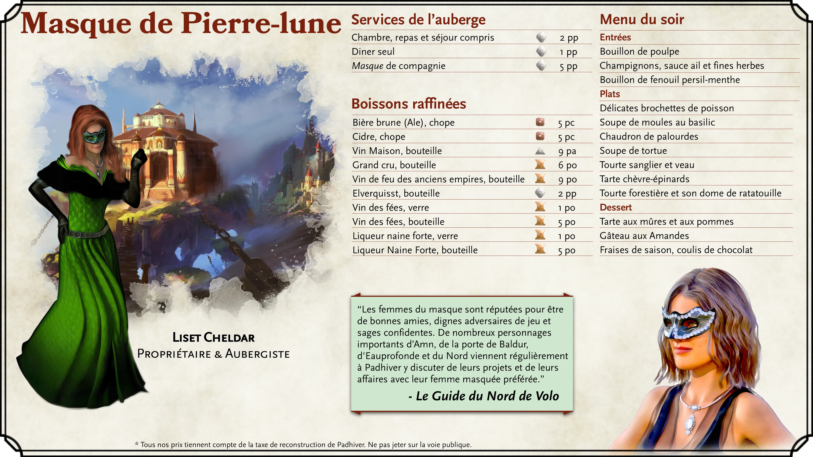

# Lieux de Padhiver

## Castel-Nièvre

{.print-only .print-bottom-right}

Le Castel-Nièvre, dominant l’extrémité ouest de la ville, est incontournable. Ce château se trouve sur les falaises rocheuses et les affleurements du côté nord de l’estuaire où la rivière Padhiver et la mer des épées se rencontrent. Le château est construit sur un rocher circulaire duquel trois ponts rayonnent sur la rivière Padhiver : le pont du dragon endormi, le pont de la wyverne ailée et le pont du dauphin.

Le château chevauche les frontières entre l’Enclave des Protecteurs, les Docks de Padhiver et le quartier de Bluelake. Au cours de l’histoire, Castel-Nièvre a été revendiqué comme faisant partie de nombreux quartiers de la ville, mais il serait peut-être préférable de considérer le château comme son propre quartier. Les trois ponts autour du château constituent une partie essentielle de l’infrastructure de la ville, offrant un moyen de traverser la rivière Padhiver et de se rendre entre les quartiers de l’Enclave des Protecteurs et Bluelake.

La structure intérieure et extérieure du château est actuellement en mauvais état, ce qui le rend trop dangereux pour toute habitation. L’actuel chef de facto de la ville, *Lord Dagult Longuebraise*, fait des incursions dans la restauration de Castel-Nièvre.

#### Castel-Nièvre : Ascension et chute

Un visiteur de Padhiver peut noter que son architecture diffère un peu de celle des autres parties de la ville. En effet, Castel-Nièvre a en fait plus d’un millénaire, ayant été commandé par l’elfe du soleil, *Lord Halueth Never*, célèbre pour avoir conquis la ville d’Illusk (dont les ruines se trouvent maintenant sous Luskan). Une grande partie de Castel-Nièvre a vraisemblablement été construite entre -10 DR (la conquête d’Illusk par *Lord Never*) et 87 DR (l’époque où Padhiver a été officiellement fondée en tant que ville).

Tout au long des nombreuses attaques et catastrophes de Padhiver, Castel-Nièvre s’est imposé comme un symbole imposant de la détermination de la ville ainsi qu’un monument aux gloires passées. Cela ne veut pas dire, cependant, que le château a été laissé indemne. La catastrophe la plus importante pour Castel-Nièvre fut peut-être en 1451 DR lorsque "[le cataclysme](history-of-neverwinter)" frappa Padhiver et laissa la majeure partie de Castel-Nièvre en ruines et tua presque tous ses habitants (y compris la lignée des dirigeants). Castel-Nièvre reste aujourd’hui hanté par les esprits des victimes du cataclysme.

(print-page)

#### L’intérieur du château

Explorer l’intérieur de Castel-Nièvre est actuellement une activité périlleuse. Les aventuriers cherchant à naviguer dans le château le trouveraient inhospitalier en raison à la fois de ses habitants fantomatiques et des simples dangers liés à l’exploration d’un bâtiment si gravement endommagé. Le château est une structure massive avec d’innombrables étages qui montent vers le ciel et descendent vers les profondeurs. Il a un certain nombre de zones de danger bien documentées:
- ***L’Atrium***. L’atrium, maintenant barricadé pour empêcher la lumière du soleil d’entrer et la chaleur de la pourriture de sortir, contient une étrange exposition de squelettes d’oiseaux exotiques dans des cages dorées. L’atrium abrite désormais des [Myconids](/monster/myconid-adult) territoriaux qui attaqueront et se régaleront d’intrus.
- ***Galerie des Glaces***. Auparavant une longue salle des miroirs où la noblesse pratiquait la démarche et la posture, tout intrus mortel qui entre dans cette salle trouvera une recréation magique de la destruction de la salle. Des éclats de verre miroir volant et des ruines enflammées seront lancés sur tous ceux qui restent trop longtemps dans le hall.
- ***Jamais en dessous***. Les catacombes sous le château, appelées "Neverneath", présentent un enchantement qui fait changer dynamiquement la disposition en forme de labyrinthe avec une certaine malveillance. Les structures changeront pour créer des impasses, des tunnels qui ramènent sur eux-mêmes ou des portes qui mènent à de nouveaux emplacements à chaque fois qu’elles sont ouvertes. Tout cela sert à piéger les aventuriers jusqu’à ce qu’ils rencontrent leur mort, probablement sous les griffes des nombreuses [gargouilles](/monster/gargoyle) des catacombes.
- ***La Voûte des Neuf***. Ce tombeau est le lieu de repos des neuf gardes du corps de la lignée royale de Padhiver. La voûte contient une chambre extérieure qui comporte des torches éternelles qui éclairent la pièce lorsque les mortels entrent. Les morts-vivants se cachent dans l’ombre de cette chambre extérieure. La chambre intérieure, scellée derrière une porte en pierre géante portant le sceau de Padhiver, possède neuf cercueils en marbre qui encerclent un trône. Les visiteurs qui parviennent à se rendre dans la chambre intérieure de la Voûte des Neuf et à se reposer peuvent se réveiller pour trouver les esprits des Neuf qui veillent sur eux.

(print-column)

#### La restauration de Castel-Nièvre

*Seigneur Dagult Longuebraise* a fait de la restauration de Castel-Nièvre une priorité de la ville. Il s’agit d’une entreprise colossale qui prendra probablement des années, voire des décennies. *Longuebraise* voit dans cette entreprise une poursuite symbolique de la restauration de la ville.

Malheureusement, l’une des premières parties du château qui *a été* restaurée pour un usage fonctionnel sont ses donjons. *Longuebraise* a ordonné que les personnes de Padhiver reconnues coupables de crimes graves soient placées dans les donjons du château, appelés "Les Trous" par les habitants. Les exécutions ont lieu tous les jours, à midi, dans Les Trous - généralement deux jours après l’envoi du prisonnier aux Trous.

|**Inspiration pour le Maître du Donjon**|
|---|
|***Marchands meurtriers***. La restauration de Castel-Nièvre s’est faite au prix d’une fiscalité élevée pour la population de Padhiver. Cela a bouleversé certains marchands puissants avec des poches profondes et une compagnie peu recommandable. *Lord Dagult Longuebraise* sait que des tentatives d’assassinat sont probables et charge le groupe de sa protection et de l’élimination de ses assassins potentiels.|
|***Reliques sentimentales***. Un noble de Padhiver maintenant âgé a perdu un être cher dans la destruction du château il y a près d’un demi-siècle. Le noble âgé charge le groupe d’entrer dans le château en ruine pour récupérer une relique sentimentale du corps de leur amant perdu.|
|***Construction bloquée***. Les équipages supervisant la restauration du château savent que les fantômes et autres monstres devront être éliminés du château. *Lord Longuebraise* a engagé des guerriers et des mages pour les aider. Cependant, la construction s’est arrêtée car l’équipage a trouvé une barrière magique qu’ils ne peuvent pas franchir. Le groupe doit rechercher un moyen de relancer la construction.|
{.dmidea}

|**En savoir plus**|
|---|
|*Acquisitions Incorporated*, p. 121 - 122, (5th Edition)|
|*Guide des aventuriers de la côte des Épées*, p. 51, (5th Edition)|
|*Neverwinter Campaign Setting*, p. 148 - 149, (4th Edition)|
|*Grand History of the Realms*, p. 59, 61, (3rd Edition)|
|*The North - Guide to the Savage Frontier - Cities and Civilizations*, p. 16 (2nd Edition)|
|*Volo’s Guide to the North*, p. 134 (2nd Edition)|
{.references}

(print-page)

## Enclave du Protecteur

### Le palais de justice

Le palais de justice est aussi le temple principal de Tyr, dieu de la loi et de la justice. Les grands murs de pierre de la salle, ses imposants piliers et son haut toit en dôme en font une structure impressionnante et intimidante. Son intérieur est également assez grand pour abriter de grandes races telles que des géants et des dragons.

Bien plus qu’un simple temple à une divinité, le palais de justice faisait office de tribunal de la ville pour les affaires mineures (c’est-à-dire excluant les crimes où l’accusé était de naissance noble, sans citoyenneté ou accusé de meurtre). Il servait également de terrain d’exercice et d’entraînement à l’armement discipliné pour les fidèles qui défendaient le temple et ce qu’il représentait. Les fonctions de la salle ont en grande partie cessé avec la mort de Tyr à la fin des années 1300 DR.

Même après la mort de *Tyr*, les habitants de Padhiver ont refusé de réutiliser le temple pour vénérer d’autres divinités. Lorsque *Lord Longuebraise* est arrivé dans la ville, il y a installé un sacerdoce temporaire de Torm, estimant qu’il y avait des similitudes dans les principes religieux. Il a également utilisé le temple comme base pour ses opérations dans la ville, ainsi que comme résidence personnelle. Ces deux actions ont rencontré la désapprobation des habitants de la ville.

Avec la récente résurrection de *Tyr*, le temple lui a été reconsacré, et *Lord Longuebraise* habite maintenant une villa privée. La restauration du palais a été très appréciée par les citoyens de Padhiver et a beaucoup contribué à améliorer l’estime de *Lord Longuebraise* auprès des habitants. Avec le retour du palais de justice à son ancienne gloire, il sert à nouveau de point central, à la fois dans l’emplacement physique et dans l’esprit, de l’Enclave du Protecteur.

|**En savoir plus**|
|---|
|*Guide des aventuriers de la côte des Épées*, p. 51, (5th Edition)|
|*Neverwinter Campaign Setting*, p. 140 - 141, (4th Edition)|
|*Volo’s Guide to the North*, p. 133 (2nd Edition)|
{.references}

### La Maison du Savoir

La Maison du Savoir est à la fois une bibliothèque et le temple principal d’*Oghma* dans la ville de Padhiver. Sur le plan architectural, elle est considérée comme l’une des structures les plus impressionnantes et les plus belles de la ville - avec de nombreuses fenêtres et un impressionnant toit voûté. Ses vastes rayonnages contiennent plusieurs siècles d'ouvrages et documents précieux, y compris la paperasse gouvernementale récente, car la ville n’a pas de siège officiel du gouvernement à l’heure actuelle.

Comme une grande partie de Padhiver, la Maison du Savoir a subi une destruction quasi totale avec l’éruption du Mont Hautchaud en 1451 CV. Un jeune maître du savoir dévoué, *Atlavast*, a sauvé une grande partie du précieux contenu de la bibliothèque en scellant le sanctuaire intérieur du temple et en se piégeant à l’intérieur. Seul et dans la solitude, *Atlavast* a réussi à survivre au cataclysme et à sauver des multitudes de tomes, documents et artefacts rares. Cependant, il est rapidement devenu reclus et l’isolement l'a rendu un peu fou. Il a passé son temps à cataloguer et à réorganiser à plusieurs reprises la bibliothèque. Il est devenu extrêmement protecteur de ce contenu. Pendant ce temps, les sections extérieures de la Maison de la Connaissance ont été prises en charge par divers squatters, y compris des cultistes Ashmadai adorateurs du démon.

Depuis le scellement du gouffre, les fidèles d’Oghma sont retournés au temple et travaillent à le restaurer en tant que centre de connaissance et d’apprentissage. Le sévère Grand Scribe *Spivey Liethennson* supervise désormais la reconstruction de la Maison avec une poigne de fer et un tempérament colérique. L’extérieur de la Maison de la Connaissance a déjà été en grande partie restauré, bien que de nombreux travaux restent en cours à l’intérieur. Pourtant, la maison est redevenue un lieu fonctionnel pour ceux qui recherchent des traditions et des archives locales.

|**Inspiration pour le Maître du Donjon**|
|---|
|***Informations gênantes***. Les joueurs à la recherche de connaissances spécifiques sur Padhiver ou la région environnante seraient avisés de considérer la vaste richesse d’informations stockées à la Maison de la Connaissance. Cependant, pour accéder à certaines connaissances, le groupe devra peut-être faire face à l'irritable *Grand Scribe Liethennson* ou au comportement fêlé et surprotecteur du Maître du savoir *Atlavast*. L’un ou l’autre peut faire en sorte que le groupe fasse ses preuves d’une manière ou d’une autre avant de se voir confier le contenu de la bibliothèque.|
{.dmidea}

|**En savoir plus**|
|---|
|*Guide des aventuriers de la côte des Épées*, p. 51, (5e Édition)|
|*Acquisitions Incorporated*, p. 122, (5th Edition)|
|*Neverwinter Campaign Setting*, p. 144 - 145, (4th Edition)|
|*The North - Guide to the Savage Frontier - Cities and Civilizations*, p. 16 (2nd Edition)|
{.references}

(print-page)

{.size-cover .no-margin .print-only}

## Les Terres flottantes

L’une des caractéristiques les plus enchanteresses de la ville de Padhiver est ses trois grandes terres flottantes. La Magepeste de 1385 CV a provoqué le soulèvement de morceaux de Padhiver (ainsi que d’autres zones de toute la planète Toril) qui ont commencé à flotter. Les habitants industrieux de Padhiver ont pu attacher quelques-unes de ces mottes de terre avec des cordes et les empêcher de s’envoler vers la Côte des épées.

{.size-full .screen-only .before-next-page-header}

### Le Masque de Pierre-lune

Le Masque de Pierre-lune est une grande auberge qui se trouve sur une terre flottante reliée aux quais de l’Enclave du Protecteur. Il est considéré par beaucoup comme l’auberge la plus raffinée et la plus luxueuse de Padhiver. Le lieu porte le nom des demi-masques portés par tout son personnel, qui sont bordés de pierres de lune incandescentes.

(print-column)

#### Le personnel du Masque

On pourrait supposer que les chambres impeccables et la vue incomparable du Masque de Pierre-lune sont ce qui attire ses clients, mais c’est en fait le personnel du Masque qui est le principal attrait de l’auberge. Les membres du personnel sont formés pour être des compagnons qualifiés ainsi que des confidents amicaux et loyaux. Ils offrent une conversation érudite et sont compétents dans une grande variété de jeux. C’est cette compagnie qui a fait du Masque de Pierre-lune une destination de choix pour les personnes riches et de haut rang depuis plus d’un siècle. 

{.print-bottom-right .with-margin}

(print-page)

Bien que le Masque de Pierre-lune n'emploie plus uniquement des femmes, tous les employés en contact avec la clientèle sont exceptionnellement attrayants. Les employés sont tous vêtus de noir, chacun portant également les masques éponymes de l'auberge et une amulette. Cependant, ces vêtements ne sont pas de simples uniformes. Les masques fournissent au porteur les capacités de Vision dans le noir, permettant à tout le personnel de traverser gracieusement les zones sombres ou ténébreuses de l'auberge. Les amulettes, également magiques, offrent au personnel une immunité contre la lecture de l'esprit ou le contrôle mental - une qualité importante compte tenu de la quantité d'informations sensibles confiées aux compagnons de l'auberge. Les amulettes permettent également une communication magique avec le propriétaire de l'auberge en utilisant uniquement la télépathie - une caractéristique de sécurité importante si un employé rencontrait un jour un invité indiscipliné ou peu recommandable.

La propriétaire actuelle du Masque de Pierre-lune est *Liset Cheldar*, une femme demi-elfe. On dit qu’elle est la descendante de l’ancien propriétaire du Masque, *Ophala Cheldarstorn*. Contrairement à *Ophala*, qui était un mage puissant, *Liset* ne semble pas posséder de tels pouvoirs. Elle est sympathique et connue pour flirter avec les invités.

#### Les commodités du masque

L’auberge dispose d’une grande salle à manger chaleureuse au rez-de-chaussée. La pièce sert également de salon confortable avec un impressionnant foyer. Le reste du rez-de-chaussée est occupé par des cuisines dédiées à la préparation de la cuisine gastronomique pour les nombreux hôtes de l’auberge. Un grand escalier en colimaçon mène de la salle à manger aux chambres d’hôtes au-dessus. L’atmosphère de la salle à manger est généralement détendue avec des conversations polies partout.

Les chambres occupent 3 étages. Elles varient en taille, des studios à un lit aux grandes suites aux étages supérieurs. Toutes disposent de lits confortables et de tapis de fourrure somptueux. Les clients séjournant dans les chambres de l’auberge peuvent s’attendre à ce que les repas soient inclus dans le prix de leur séjour, mais l’alcool peut coûter plus cher. Naturellement, le Masque propose une sélection impressionnante de boissons raffinées.

Pour les invités voyageant par les moyens les plus élaborés, le toit comporte un palier spécial pour les coursiers ailés. On dit que le masque est chargé de panneaux muraux cachés qui peuvent s’ouvrir pour un voyage secret à l’intérieur de l’auberge elle-même. On dit que le personnel ouvre ces panneaux en prononçant certains mots magiques. Le 4e étage, juste en dessous des suites penthouse, abrite une salle des fêtes animée avec de la musique et de la danse. Une insonorisation magique garantit que cela ne dérangera aucun des invités.

(print-column)

|**Inspiration pour le Maître du Donjon**|
|---|
|***Base de connaissances***. *Liset* et les autres membres du Masque de Pierre-lune détiennent une mine d’informations et de rumeurs sur la ville. Ils ne divulgueraient jamais d’informations confidentielles sur l’un de leurs clients, mais ils pourraient informer les aventuriers d’événements et de rumeurs non confidentiels.|
|***Bonne compagnie***. Il ne serait pas rare ou surprenant de trouver des personnalités notables au Masque de Pierre de Lune, dont *Lord Dagult Longuebraise* lui-même. Utilisez cet emplacement comme lieu de rencontre notable.|
|***Babioles au sous-sol***. Si les joueurs ont pu se faufiler dans les différentes salles de stockage du sous-sol du Mask sans se faire prendre, ils pourraient trouver toutes sortes d’objets magiques.|
{.dmidea}

(print-page)

#### L’histoire du Masque

Le Masque de Pierre-lune a été construit par *Ophala Cheldarstorn*, mage et membre du Many-Starred Cloak. *Ophala* a également créé les masques magiques et les amulettes portés par le personnel. Avant que le Masque ne flotte au-dessus de Padhiver, la rumeur disait qu’il comportait des entrées secrètes où des invités spéciaux pouvaient entrer et sortir inaperçus. On disait aussi qu’il y avait des sous-sols reliés aux tunnels des zones tenues par les nains de l’Outreterre.

Au milieu des années 1400 DR, l’auberge a dérivé vers la mer des épées après que l’éruption du mont Hautchaud a cassé les attaches de corde de l’auberge. Les cordes qui attachaient l’auberge ont finalement été remplacées par de grandes chaînes solides, mais seulement après que l’auberge ait dérivé pendant des mois au-dessus de la mer des épées. Même après le retour du Masque à Padhiver, il a finalement attiré trop peu d’invités, est devenu insolvable et fermé pendant quelques décennies. Après que *Lord Dagult Longuebraise* ait lancé son mouvement "Nouveau Padhiver" pour commencer à reconstruire Padhiver, *Liset Cheldar* a pu non seulement convaincre *Longuebraise* qu’elle était l’héritière légitime du Masque de Pierre-lune, mais aussi pouvoir l’aider à financer la restauration de l’auberge à une grande partie de son ancienne gloire sous *Ophala Cheldarstorn*. En guise de remboursement, l’auberge servait souvent à loger *Longuebraise* et plusieurs de ses mercenaires et officiers tout au long des années 1470 et 1480 DR.

|**En savoir plus**|
|---|
|*Neverwinter Campaign Setting*, p. 142 - 143, (4th Edition)|
|*Storm Over Padhiver*, p. 8 - 11 (4th Edition)|
|*Volo’s Guide to the North*, p. 138 - 140 (2nd Edition)|
|*The North - Guide to the Savage Frontier - Cities and Civilizations*, p. 16 - 17 (2nd Edition)|
{.references}

### Château des pirates

Au nord-ouest de Padhiver, juste à côté de la Côte des épées, se trouve une autre terre flottante appelée "Pirates’ Skyhold". Peu de temps après la Magepeste, certains pirates de la région ont noté qu'une terre flottante pouvait servir de base défendable sur les côtes qu’ils parcouraient. Une bande de pirates, en possession d’un vaisseau spatial, a revendiqué cette terre flottante comme étant la leur et y a construit de modestes fortifications en bois.

Une mystérieuse tragédie s’est abattue sur la forteresse qui a laissé la plupart, sinon la totalité, de ses habitants pirates morts ou disparus. Leur vaisseau spatial reste amarré sur la terre flottante comme un étrange rappel de son abandon. Personne ne sait exactement ce qui s’est passé sur la forteresse, mais des dizaines de rumeurs sur l’emplacement circulent à Padhiver. Certains prétendent qu’un dragon s’est emparé de la forteresse, d’autres prétendent qu’il est habité par des Netherese, tandis que d’autres encore prétendent qu’il est hanté par toutes sortes de fantômes.

On dit aussi qu’un trésorcaché existe toujours sur l'île. Les pirates auraient entreposé leur butin dans la forteresse, et compte tenu de leur disparition soudaine, on pense que le trésor doit sûrement encore se trouver quelque part. Cependant, se rendre à la forteresse n’est pas une mince affaire. Une forme de transport aérien ou magique devra être achetée pour accéder à la zone.

|**Inspiration pour le maître du donjon**|
|---|
|***Un livre ouvert***. Dans la quatrième édition, le Pirate’s Skyhold a été intentionnellement laissé mystérieux et ouvert aux maîtres de donjon pour créer leurs propres aventures sur place.|
|***Trésor du Dragon***. C’est bien connu, les dragons adorent un bon trésor ! Un dragon plus jeune a peut-être attaqué le Fort céleste, tué tous les habitants et gardé le butin des pirates comme son propre trésor.|
|***Pirates zombies [niv. 9-11]***. Le dieu de la mort, *Myrkul*, a été très actif dans la région (voir la trilogie [Le dragon de la Flèche de Givre](https://www.dndbeyond.com/sources/doip) et [Au delà du dragon de la Flèche de Givre](https://www.dndbeyond.com/essentials/continue-the-adventure) Sleeping Dragon’s Wake). Les morts-vivants ont envahi le Fort Céleste et l’ont transformé en un fort des damnés. Le Death Knight-Dreadnaught est étrangement ancré sous la Earthmote.|
|***Je vais en prendre un de chaque***. Myrkul a envoyé un [Dracolich](/monster/adult-blue-dracolich){.red} ou [Ghost Dragon](/monster/ghost-dragon){.red} au Fort Céleste, où il repose sur un trésor de pirates butin et seigneurs d’une armée de pirates morts-vivants !|
{.dmidea}

|**En savoir plus**|
|---|
|1 - *Neverwinter Campaign Setting*, p. 148, (4th Edition)|
{.references}

### Le Flotteur des pêcheurs

Fisher’s Float est une terre flottante juste au sud-ouest de Padhiver où une chaleureuse guilde de pêcheurs a fait sa maison et son siège social. Les maisons et les entrepôts visibles sur la terre flottante sont austères à tous points de vue. Les petites cabanes en bois impliquent certainement que les pêcheurs et les marins qui habitent le Flotteur n’ont pas un style de vie indulgent.

Alors que ces pêcheurs fournissent pacifiquement une grande partie des fruits de mer de Padhiver, ils parviennent également à en garder une grande partie pour eux. En conséquence, il existe de nombreuses rumeurs sur le Flotteur des pêcheurs. Une rumeur particulièrement répandue est que ses habitants ont sous une forme ou une autre fait allégeance à des dieux marins maléfiques et/ou à des monstres marins.

|**En savoir plus**|
|---|
|*Neverwinter Campaign Setting*, p. 148, (4th Edition)|
{.references}

(print-page-single-column)

## Les Docks

{.size-full .screen-only .before-next-page-header}

### Le Léviathan échoué

Le Léviathan était un infâme navire pirate qui rôdait le long de la Côte des épées, semant la terreur sur ceux qui croisaient son chemin. Le capitaine du Léviathan, *Harrag*, était un défi redoutable pour tous ceux qui le rencontraient en mer, et aucun marin ne sentait son trésor en sécurité pendant qu’*Harrag* chassait sur la mer des épées. Quelque temps après l’éruption du mont Hautchaud, le Léviathan s’est échoué dans le nord de Padhiver et a percé sa coque. Plutôt que d’abandonner son navire, *Harrag* est resté avec lui pendant que les quais de la ville étaient reconstruits autour du navire (dans le cadre des efforts de reconstruction générale de l’époque). *Harrag* a supervisé la conversion de l’épave en une auberge et une taverne prospères.

{.image-beached-leviathan}

#### Marcher sur les planches

Le navire est divisé en trois niveaux pour les invités. Le premier niveau ("la cale"), accessible depuis les quais, abrite la cuisine et la taverne du Léviathan échoué. La taverne dispose d’un grand nombre de tables adaptées aux fêtes de toutes tailles. Le deuxième niveau (« les quartiers ») abrite une auberge avec 12 chambres de différentes tailles à louer, et le troisième niveau (« la terrasse ») comprend des salons privés et des tables qui peuvent être louées à un prix plus élevé. Au sommet du "pont" se trouve une cabine supérieure supplémentaire qui sert de quartier privé au *capitaine Harrag*. Les différents niveaux des ponts sont accessibles par un petit escalier en colimaçon au centre du navire. De plus, un ascenseur actionné par poulie peut transporter des marchandises entre chacun des niveaux via un petit puits qui s’étend à travers chacun des niveaux.

L’ensemble du navire est décoré d’accessoires à thème nautique, dont beaucoup sont des trophées des conquêtes passées d’*Harrag*. L’intérieur du navire et son ameublement sont bien conçus, avec des boiseries en chêne et en cerisier. Cependant, des années de clients qui vont, viennent et se bagarrent ont laissé l’intérieur finement travaillé bien usé.

#### Grog et gangs

La clientèle du Léviathan échoué est généralement un groupe humble et mixte. Tous ceux qui ont de la monnaie à dépenser sont les bienvenus à la taverne. Les clients habituels comprennent autant de marins que de résidents plus terrestres de Padhiver. Le personnel et les clients utilisent fréquemment l’argot nautique dans la taverne (par exemple, se référer à un ivrogne comme "lest" ou appeler un nouveau venu un "corsaire"). Il est très courant que les visiteurs terriens se sentent un peu perdus lorsqu’il s’agit d’analyser le dialecte des marins. Les jeux de hasard et les bagarres sont fréquents, bien que ces derniers soient susceptibles de vous faire rapidement expulser du navire.

Il est également extrêmement courant de trouver un certain nombre de factions minables représentées au Léviathan échoué. On voit couramment à la taverne des contrebandiers, des voleurs et des gangs de presse. Pour ces acabits, le Léviathan échoué sert de lieu d’affaires important. Des affaires sont conclues, des échanges sont effectués et le marin ivre occasionnel est réduit en esclavage. Tout cela est relativement bien connu de *Lord Longuebraise* et de ses forces, qui surveillent souvent discrètement la taverne pour se tenir au courant des dessous miteux de la ville. *Longuebraise* et sa montre, cependant, n’interviennent presque jamais dans ces magouilles, choisissant plutôt de garder la taverne comme source d’information fiable.

(print-page)

#### Fidèles compagnons de bord

Un établissement comme le Léviathan échoué ne pourrait exister sans un capitaine intrépide et un équipage chaleureux pour le seconder. Le Léviathan échoué a une collection colorée de personnel et d'habitués qui font de l'endroit un lieu si intéressant. Devenir un habitué de la taverne est susceptible de vous valoir un surnom approprié sur le thème nautique.

***Capitaine Harrag.*** *Le Capitaine Harrag* est un homme costaud et poilu avec une seule jambe (il a perdu l'autre dans un combat avec un sahuagin). Il a un extérieur effrayant et bourru, mais ceux qui le connaissent le mieux savent que l'homme possède une quantité impressionnante de compassion et d'empathie. Le Léviathan échoué est un véritable travail d'amour pour le capitaine, et il tire une immense fierté de l'établissement. Cela dit, *Harrag* n'est pas un enfant de coeur. Il n'hésitera pas à conclure de bonnes affaires pour son entreprise, même si la tactique exige qu'il soit impitoyable. De même, ceux qui menacent l'établissement seront traités rapidement et fermement.

##### Personnel ("Équipage")

***Andrella.*** "Camarade" - *Andrella* est le bras droit de Harrag. Une humaine d'âge moyen, elle est la barmaid principale (*Jyseria*, *Sandrine* et *Willow* étant les autres barmaids). Elle dirige le personnel quand *Harrag* n'est pas là et se soucie très profondément de lui. Elle a développé une sorte d'amour secret et non partagé pour le capitaine.

***Feng.*** Un très grand mâle demi-orc, *Feng* sert de videur de la taverne.

***Tabnab.*** Un homme bizarre, *Tabnab* est le cuisinier de l'auberge.

##### Habitués

***Len-jes.*** "Capitaine de port" - *Len-jes*, une genasi de l'eau cicatrisée, est en fait la capitaine du port de Padhiver. Elle loue une chambre au Léviathan échoué de manière semi-régulière.

***Umi.*** "Barreuse" - *Umi*, également une femme genasi de l’eau, est la cousine de *Len-jes* et sert de remplaçante à *Feng* si une situation à la taverne devient trop tapageuse. Elle est très habile avec l'épée.

***Bobrik Highmantle.*** "Maître d'équipage" - *Bobrik*, un nain mâle corpulent avec un singe de compagnie, est un habitué du bar. Il a un tempérament fougueux qui le fait parfois expulser de la taverne pendant quelques jours.

***Markul.*** "Vigie" - *Markul*, un jeune humain, écoute constamment tout ce qui se passe à la taverne. Pour le juste prix, il est prêt à partager les secrets qu'il a appris, tant qu'il ne s'agit pas de secrets qui, selon lui, nuiraient au Léviathan.

***Ettain.*** "Calfateur" - *Ettain*, un homme demi-elfe, travaille comme bricoleur du navire. C'est un charpentier qualifié qui peut réparer le navire ainsi que fabriquer ou réparer ses meubles en cas de besoin. Il connaît chaque centimètre carré du navire, y compris ses secrets.

***Korin.*** "Chanteur" - Korin, un barde draconique d'âge moyen, joue de la musique et chante à la taverne. Il est souvent connu pour faire chanter tout le bar des chants de marins et des chansons folkloriques. Il accepte volontiers les pourboires et les boissons. Sa famille a été massacrée par des cultistes, qu'il transformera parfois en un chant funèbre chargé de chagrin.

(print-page)

#### Stormy Waters

Throughout its relatively brief history in Padhiver, the Léviathan échoué has found itself embroiled in conflict well beyond its seemingly-humble station. This is largely because of the type of patronage allowed in the Leviathan, in addition to Lord Longuebraise’s own involvement with the locale. It was with Longuebraise’s support and patronage that Harrag was able to create the establishment at all — as *Longuebraise* was ultimately the one to expunge record of his numerous crimes on the high seas. This made Harrag a true *Longuebraise* loyalist.*Lord Longuebraise* absolutely uses Harrag for his own ambitions. *Longuebraise* even went so far as to turn Harrag’s own shadow into a sentient creature used to spy on the facility. 

In 1479, as part of the scuffle over the true heir to the throne of Padhiver and the lost crown of Alagondar, the Leviathan was attacked by furious Padhiver members. The Leviathan was only saved because of intervention from adventurers and Longuebraise’s top general, General Sabine. Later, that same year, Ashmadai cultists and demons infiltrated the Léviathan échoué and killed one of General Sabine’s top advisors. This was ultimately part of a larger plot by a powerful mage named Elden Vargas to use the powers of Asmodeus to his own purposes. 

|**En savoir plus**|
|---|
|*Dungeon*, Issue #193, p. 79 -83, (4th Edition)|
|*Neverwinter Campaign Setting*, p. 154-155, (4th Edition)|
|*Lost Crown of Padhiver*, p. 18 - 19, (4th Edition)|
|*Storm Over Padhiver*, p. 17 - 18, (4th Edition)|
{.references}

### The Driftwood Tavern

Almost more of a museum than a tavern, the upscale and expensive Driftwood Tavern sits in the northern docks area of Padhiver. The tavern is one of Padhiver’s older drinking locales — having been in operation since before the Magepeste of 1385 DR. After the cataclysm of 1451 DR, the tavern was used to shelter refugees and served as a makeshift city hall while the city regained some semblance of normalcy.

The establishment is chock-full of bric-a-brac. Rather than viewing the establishment as cluttered or disorganized, however, many view it as a beautiful tribute to "Old Padhiver" and a vital part of preserving the city’s history. Indeed, many travelers visit the tavern and pay its high prices for drinks and/or lodging simply to enjoy the relics collected at the establishment.

Madame Rosene, now roughly 70 years old, runs the establishment. In 1479 DR, she was secretly the leader of the Sons of Alagondar (i.e., the Graycloaks), a rebel group that opposed Lord Longuebraise’s rule in the city. The faction, now, has largely made peace with Longuebraise’s rule, many members even enlisting in Padhiver’s army (feeling it better that they control their own army rather than continuing to let Mintarn mercenaries have power in the city). Madame Rosene is a fount of knowledge regarding the city’s history and will happily chat about old times with patrons.

|**En savoir plus**|
|---|
|*Guide des aventuriers de la côte des Épées*, p. 52, (5th Edition)|
|*Neverwinter Campaign Setting*, p. 154-155, (4th Edition)|
{.references}

### The Tarmalune Trade House

A trade cartel from the city of Tarmalune has procured a large warehouse complex on the southern docks of Padhiver. Outside of the docks, a large swath of stalls and booths have been set up with goods for sale. The Tarmalune merchants are trying desperately to establish a solid trade presence in the area, largely to counter their rival traders from the city of Lylorn that have recently established a trade route in nearby Luskan.

|**Inspiration pour le Maître du Donjon**|
|---|
|***No Free Two-Day Shipping***. If your players need something very specific and hard-to-acquire, it would be somewhat reasonable that the Tarmalune’s large trade network might be able to procure the item. However, it would *also* be entirely reasonable to expect this favor to come at a high price and to take some time. After all, it takes a long time, a lot of resources, and a lot of risk to sail such a distance in Toril.|
{.dmidea}

|**En savoir plus**|
|---|
|*Neverwinter Campaign Setting*, p. 147, (4th Edition)|
{.references}

(print-page)

{.print-only .print-top-left}

(print-column)

## Tower District

{.size-full .screen-only .before-next-page-header}

### The Shard of the Moon

The Shard of the Moon, formerly called "The Shard of Night", is a floating tower in the Tower District of Padhiver. The tower has had a storied journey through both the Material Plane and Plane of Shadow.

The tower began its existence as Moonshadow Hall, over a thousand miles away from Padhiver, in the city of Yhaunn. In the late 14th century DR, the Shadovar (dwellers of Shadowfell and one of the few remaining factions of Netherese) assaulted the temple and magically tore away one of its towers and sent it to Shadowfell. The Shadovar learned they were able to manifest the tower at arbitrary locations in the mortal realms, and thus placed it strategically floating over Padhiver during the Magepeste. The Netherese could use a portal in the tower to transport between Xinlenal and Padhiver. 

The tower was darkened black and cast no shadow in the day. This was actually because the temple was magically manipulated to absorb shadow. This shadow, in turn, powered the tower’s teleportation devices. The ominous, forboding tower looming overhead was largely avoided by all in Padhiver as any who ventured inside would never return.

{.print-bottom-right}

(print-page)

In 1479 DR, adventurers raided the tower and allowed the priests of Selûne to return to the tower and perform a purification, restoring the tower to its alabaster white appearance. Now, at night when three magical shards are placed within, or below, the floating tower, a stairway of solid moonlight descends from the tower entrance. The priests of Selûne will allow only trusted visitors entrance into the tower. Those particularly-trusted visitors that take a long rest in the tower find that they receive an extra healing surge until they next take a long rest.

|**En savoir plus**|
|---|
|*Dungeon*, Issue #193, p. 57 - 78, (4th Edition)|
|*Neverwinter Campaign Setting*, p. 158, (4th Edition)|
{.references}

### The Cloak Tower

The Cloak Tower is a wizard tower that served as a meeting place and citadel to the Many-Starred Cloak order of wizards. The tower suffered a prolonged occupation by orcs, but has recently returned to the custody of the Order of the Many-Starred Cloaks.

#### Vanishing Fortifications

The Cloak Tower, and all of the wizards within, disappeared during the Magepeste in 1385 DR. The tower mysteriously returned about six months later — albeit in a new location. However, there were no traces of the wizards that had once resided there. 

Naturally, once the tower returned to Padhiver, it didn’t take long for thieves to attempt looting the tower. The tower, after all, was thought to contain a wondrous magical device found in a Netherese ruin called "Halavar’s Universal Pantograph". The device could reportedly duplicate metal objects that were "the size of a large throne or smaller" — this included coins! However, all the thieves soon perished in the tower, leaving a sole survivor to recount the tales of what was seen.

The thieves didn’t locate the magical device, and they saw neither wizards nor their bodies. The colorful cloaks mysteriously remained, however, hanging on the pegs where they were left. Suddenly, the colorful cloaks came to life and smothered the thieves to death, save the sole survivor.

#### Orc Infestation

The Many-Arrows orc tribe invaded the tower and were able to claim it. The Padhiver residents, assuming the tower was warded by some leftover magical defenses left by the Many-Starred Cloak wizards, thought the orcs too would soon perish in the tower. The orcs, however, seemingly did not meet any resistance in the tower and were able to hold it.

Lord *Longuebraise* tolerated the orcs in the location largely because he had no better option. The tower was actually one of the most fortified locations in the city, which left *Longuebraise* simply biding his time until he could figure out a way to rid the city of the orcs. Luckily, the Many-Arrow orcs decided to vacate the tower and move east with to help their brethren battle the dwarves.

The Order of the Many-Starred Cloaks has once again become active with some ranking members even working with*Lord Longuebraise* to secure the region. It is presumed that custody of the Cloak Tower has returned to the Many-Starred Cloaks.

|**En savoir plus**|
|---|
|*Guide des aventuriers de la côte des Épées*, p. 51 (5th Edition)|
|*Storm Lord’s Wrath*, sec. *House of Thalivar* (5th Edition)|
|*Neverwinter Campaign Setting*, p. 120, 157 (4th Edition)|
|*Volo’s Guide to the North*, p. 134 (2nd Edition)|
{.references}

{.print-bottom-right .with-margin}

(print-page)

{.size-cover .no-margin .before-next-page-header .print-only}

{.size-full .screen-only .before-next-page-header}

### The Fallen Tower

The Fallen Tower is a tavern constructed in the ruins of a wizard’s tower. The tavern features a rather unique and macabre nightly spectacle that has kept it a popular drinking location for well over a century.

#### The Tower’s History

Decades before the Magepeste, the tower was owned by a powerful wizard named Llomnauvel "Firehands" Oloadhin. The Arcane Brotherhood coveted Oloadhin’s accumulation of magical items. One night, the Brotherhood violently attacked the tower in an attempt to steal the magical goods and capture Oloadhin. A spectacular magical battle raged throughout the tower. Oloadhin had anticipated the attack and rigged his tower with all manner of magical traps, including maniacal spells that turned the trespassers into lowly sea creatures. However, Oloadhin’s traps were ultimately unable to stop the raid. Rather than let the Arcane Brotherhood take his tower and the contents within, the unhinged Oloadhin triggered a final massive spell that destroyed the tower. As the tower fell in a magical blaze, everyone inside perished (including Oloadhin himself).

(print-page)

#### The Nightly Show

Phantasmic remnants of the tower’s destruction remain at the location. Every night, at the exact time Llomnauvel triggered the explosion that destroyed the tower, visions of those final moments appear at the ruined base of the tower. These silent magical projections depict Brotherhood mages, ablaze, falling helplessly to their deaths. This is soon followed by the Brotherhood’s Overwizard falling similarly while his limbs transform into eels.

This seemingly harmless magical vision both horrified and fascinated onlookers. Naturally, some entrepreneurial individuals managed to turn this tragic spectacle into entertainment for locals and travelers alike. The base of the tower was renovated into a tavern. The area of the spectacle was railed off, and tables were placed all around it so that patrons may watch the "show" as they sipped on their drinks. Sadly, the tavern eventually gained a reputation for mediocre, overpriced drinks and a steep cover charge. That, combined with the multiple catastrophes that hit Padhiver in the 15th century DR, eventually left the tavern abandoned.

{.print-bottom-left .with-margin}

(print-column)

#### Under New Management

The Many-Arrow tribe discovered and started to loot the tavern and its vast wine stores when they invaded Padhiver’s Tower District. One night, in the midst of their looting and revelry at the Fallen Tower, the phantasmic images appeared and scared the orcs out of the building. The orcs eventually mustered their courage and, once realizing the phantom images were harmless, returned to the building.

An enterprising single-eared orc named "Vagdru One-Ear" restored the site to being a functioning tavern. By way of a mutual agreement between*Lord Longuebraise* and the leadership of the Many-Arrow tribe, the tavern now serves as a neutral ground between the orcs and other races that occupy the city. All are welcome to enjoy the tavern’s offerings provided they start no trouble. Any troublemakers that violate this truce are likely to face the immediate wrath of the tavern’s regular clientele. The tavern’s current offerings, however, are "humble" and priced accordingly. The wine and ale are inexpensive but satisfactory. Raw meat, of an unknown source, is served up to be prepared over an open cook fire.

|**Inspiration pour le Maître du Donjon**|
|---|
|***Technical Difficulties***. Something goes wrong, and the previously-benign nightly magical visions of the falling mages become real; the flames of the falling mages scorch patrons. Adventurers must contain the Fallen Towers magic lest the tavern’s business be ruined.|
|***Diplomatic Immunity***. The Fallen Tower is the perfect place to have a parlay between adventurers and some of the less-respected races of Faerûn.|
|***The Other White Meat***. Vagdru One-Ear tasks the adventurers with heading out into the wilds to slay some gross-looking, level-appropriate monsters (e.g., [Giant Spiders](/monster/giant-spider){.red} or a [Sibriex](/monster/sibriex){.red}!) and return their corpses as proof of their accomplishments. To the adventurers’ horror, he serves the monsters’ meat to patrons for that night’s dinner.|
{.dmidea}

|**En savoir plus**|
|---|
|*Neverwinter Campaign Setting*, p. 157, (4th Edition)|
|*Volo’s Guide to the North*, p. 135 - 138 (2nd Edition)|
|*The North - Guide to the Savage Frontier - Cities and Civilizations*, p. 15 - 16 (2nd Edition)|
{.references}

(print-page)

## Bluelake District

The Bluelake District, formerly the "Blacklake District", was home to many of the noble estates in Padhiver. Most of the estates fared well against the cataclysm thanks to their sturdy construction. However, many were left abandoned after their owners perished in the cataclysm. The abandoned buildings proved fertile ground for the seedy underbelly of the city to gain a foothold. 

Lord *Longuebraise* and his mercenaries saw great opportunity in resettling the overgrown estates in the district. However, when they attempted to do so, they found themselves attacked by a variety of factions. Seemingly every shadow faction of the city, from the Sons of Alagondar to the Dead Rats, had taken up residence in the area. It became extremely dangerous to traverse this section of the city. In recent years, however, it has improved dramatically.

### Bluelake

Bluelake, formerly called "Blacklake", is a lake that sits in the center of its namesake district. The lake is used for boating activities at times. However, in the summer, the lake’s level decreases dramatically and becomes somewhat more of a swamp.

The lake became particularly vile and sludge-filled after the eruption of Mount Hautchaud, which filled the lake with ash.*Lord Longuebraise* made dredging and restoring the lake one of his priorities. This effort seems to have been successful, and it was renamed "Bluelake".

|**En savoir plus**|
|---|
|*Neverwinter Campaign Setting*, p. 153 - 154, (4th Edition)|
|*Lost Crown of Padhiver*, p. 33, (4th Edition)|
{.references}

### House of a Thousand Faces

The House of a Thousand Faces is a comfortable tavern in the Bluelake region of Padhiver. The building was once a boutique clothing store for the rich nobles of the area and is full of mirrors and mannequins displaying antiquated clothing styles. The mannequins and their reflection are what give the building its name of a "Thousand Faces". It features lush and comfortable couches where citizens sit and converse happily. 

The basement of the tavern is the secret meeting location for the Padhiver chapter of the Harpers. The Harpers, generally an organization that stands for preserving history and all things "good", have a particularly complicated history in Padhiver. The reputation of the local Padhiver chapter of the Harpers was damaged when one of its high-ranking members was caught acting as a sort of double-agent between*Lord Longuebraise* and the Sons of Alagondar (who opposed Longuebraise’s rule).

|**En savoir plus**|
|---|
|*Neverwinter Campaign Setting*, p. 153 - 154, (4th Edition)|
{.references}

## The Chasm District

### The Sealed Chasm

When Mount Hautchaud erupted, a giant canyon into a Magepeste-laden section of the Outreterre was torn open in the southeastern quarter of Padhiver. This portion of the city was essentially leveled in the process. From this giant chasm all manner of unnatural beasts emerged. Any that approached the chasm would experience anxiety and other unpleasant mental effects. A wall was erected around the region to contain the horrors that arose from the chasm.

With immense effort and expense, *Longuebraise* was able to have the chasm sealed shut with powerful magic. The chasm sealed, the district was left as not much more than leveled ruins. The area was made free for the taking. Anyone who wanted to make a settlement in the region was free to claim the land and do so. Bold settlers, particularly those too poor to do so elsewhere, are flocking to the Chasm District to build a new life for themselves. 

|**En savoir plus**|
|---|
|*Guide des aventuriers de la côte des Épées*, p. 52 - 53, (5th Edition)|
|*Neverwinter Campaign Setting*, p. 159 - 164, (4th Edition)|
{.references}

## Neverdeath

Neverdeath is Padhiver’s graveyard. It is divided into two major sections. The Pauper’s section, to the southwest, contains rows upon rows of humble graves. Many are unmarked with nameless souls that perished in one of Padhiver’s numerous tragedies and cataclysms. The other section contains more elaborate mausoleums where nobility and wealthy were laid to rest.

Both sections of Neverdeath were strongly affected by the Magepeste. In addition to physically altering the landscape of the graveyard, the corpses now spring back to life and attack visitors. Tall walls protect the horrors of the graveyard from attacking the city, and Padhiver’s residents know to stay well away from the horrors that await within. The people of Padhiver now burn their dead.

|**En savoir plus**|
|---|
|*Neverwinter Campaign Setting*, p. 145, (4th Edition)|
{.references .screen-only}