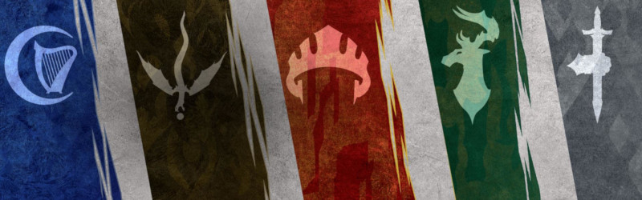

{.size-cover}
# Factions présentes à Padhiver
De nombreuses factions sont présentes à Padhiver. Quatre de ces organisations peuvent être rejointes par les personnages : l'Alliance des seigneurs, les Ménestrels, l'ordre du Gantelet et le Zhentarim. (Une cinquième faction, l'Enclave d'émeraude, n'est pas présente à Padhiver)
Les autres factions sont quand à elles plutôt réservées aux opposants des PJ.

## Ménestrels

### Généralités
{.float-left}
Ce réseau clandestin de lanceurs de sorts et d'espions cherche à faire pencher la balance en faveur des innocents, des faibles et des pauvres dans les Royaumes. Les agents des Ménestrels se targuent d'être des défenseurs incorruptibles du bien, et n'hésitent jamais à aider les opprimés. Parce qu'ils préfèrent travailler en coulisses, on ne les remarque que rarement quand ils contrarient les desseins d'un tyran, renversent un dirigeant ou barrent la route à une force émergente qui semble avoir de mauvaises intentions. Les Ménestrels surveillent le pouls des pouvoirs dans les Royaumes et travaillent sans relâche en faveur des opprimés.

Les agents des Ménestrels opèrent seuls, s'appuyant sur leur esprit et leurs vastes réseaux d'information pour obtenir un avantage sur leurs ennemis. Ils savent que la connaissance est synonyme de pouvoir, et donc que recueillir des renseignements est primordial pour leur réussite. Ils sont bien informés et ont toujours accès à de l'aide, quelle soit magique ou autre. Les plus anciens membres ont accès à des caches secrètes de la connaissance disséminées dans tout Faerûn, ainsi qu'à des contacts de confiance en poste dans chaque grande ville et cité.

L'organisation est toujours à la recherche de puissants objets, en particulier pour les garder hors de portée des méchants. Pour cela, ses agents utilisent différentes formes et identités pour accéder à des secrets soigneusement gardés comme des cartes ancestrales, des villes souterraines ou bien encore des tours de mages. Le lien entre les membres des Ménestrels est fort, et leurs amitiés sont quasiment indestructibles. Ils n'opèrent que rarement ouvertement, sauf en de rares occasions parce qu'il n'y a pas d'autre choix. Et dans ce cas, vous pouvez être sûr qu'un autre Ménestrel se trouve tout près, prêt à sortir de l'ombre et à aider un camarade si besoin en est.

> Un ménestrel est d'abord et avant tout autonome, car alors personne ne peut le tenter en utilisant le pouvoir comme béquille. Il doit être souverain de lui-même.
Par conséquent, l'âme d'un ménestrel doit être incorruptible. Beaucoup pensent l'être, mais le pouvoir se présente sous de nombreuses formes, et il trouvera sûrement votre faiblesse. De cela, soyez-en sûrs. Seul un vrai ménestrel peut passer ce test et transformer une faiblesse en force. C'est pourquoi nous sommes la main qui arrête le tyran, nourrit les opprimés et ne demande rien en retour. Nous sommes la chanson de ceux qui n'ont pas de voix.
>
> *Remallia "Remi" Haventree*<!--{p.text-right}-->

### Chapitre de Padhiver
Le sous-sol de la taverne "La Maison aux Milles visages" est le lieu de rencontre secret du chapitre de Padhiver des Ménestrels. La réputation du chapitre local a été entachée lorsqu’un de ses membres de haut rang a été surpris en train d’agir comme une sorte d’agent double entre *Lord Longuebraise* et les Fils d’Alagondar (qui s’opposaient au règne de *Longuebraise*).

### Buts

* Recueillir des informations de tout le continent.
* Promouvoir l'équité et l'égalité par des moyens détournés.
* Contrecarrer les plans des tyrans, dirigeants, gouvernements ou organisations qui deviennent trop puissants.
* Aider les faibles, les pauvres et les opprimés.

### Rangs

* Guetteur
* Ombre
* Lanterne (niv 5 minimum)
* Hibou avisé (niv 11 minimum)
* Grand ménestrel (niv 17 minimum)

### Formations

Voici les formations que cette organisation propose à ses agents :

* Instruments de musique
* Matériel de calligraphe
* Kit de déguisement

(print-page)
## Alliance des seigneurs
{.float-left}
L'Alliance des seigneurs est une association de dirigeants de villes et de cités à travers Faerûn (principalement dans le Nord) qui croient que la solidarité est nécessaire pour garder le mal à distance. Les dirigeants de Waterdeep, Lunargent, Neverwinter et d'autres cités libres dominent la coalition, et tous les seigneurs de l'alliance travaillent principalement pour le sort et la fortune de leurs propres implantations.

Les agents de l'alliance sont des bardes sophistiqués, des paladins zélés, des mages talentueux et des guerriers grisonnants. Ils sont choisis principalement pour leur fidélité et sont des experts en observation, discrétion, insinuations et combat. Soutenus par les riches et les privilégiés, ils possèdent un bel équipement (souvent déguisé pour comparaître commun), y compris un grand nombre de parchemins de sorts de communication.

Les agents de l'Alliance des seigneurs assurent la sécurité et la prospérité de la civilisation de Faerûn en se tenant unis contre les forces qui la menacent. Ils éliminent les menaces de manière proactive et par tous les moyens, se battant avec fierté pour la gloire et la sécurité de leurs peuples et des princes les gouvernent. Toutefois, les agents de l'alliance sont souvent des chasseurs de gloire qui cherchent à prendre l'avantage sur leurs homologues des autres villes de l'alliance. Les dirigeants de l'alliance savent que l'ordre ne survivra que si ses membres se soutiennent mutuellement, ce qui demande un fin équilibre entre fierté et diplomatie. Les roublards sont rares au sein de l'Alliance des seigneurs, mais des défections se produisent.

À ce jour les villes membres de l'Alliance des seigneurs sont Waterdeep, Neverwinter, Lunargent, la Porte de Baldur, Gué de la dague, Mirabar, Longueselle, Castelmithral, Amphail et Yartar.

> Tout le monde veut dormir la nuit et se sentir en sécurité dans sa maison, mais combien sont prêts à faire le nécessaire pour garder la marée du mal à distance ? À se tenir debout sous la pluie et dans le froid, en attendant la bataille alors que la faim vous tenaille le ventre ? Beaucoup souhaitent récolter les fruits d'une bonne récolte, mais peu prennent soin d'enlever les pierres et de labourer les champs avant la plantation.
> L'Alliance des seigneurs combat des choses dont le marchand dans son lit n'a même jamais entendu parler. Nous éliminons les menaces avant que le maire de la ville n'en entende parler. Nous faisons en sorte que les choses mauvaises disparaissent. C'est ce à quoi nous sommes bons.
>
> *Rameel Jos*<!--{p.text-right}-->

### Section de Padhiver
[Homebrew]
Basés au Palais de Justice, incarné par Général Sabine.

### Buts

* Assurer la sécurité et la prospérité des villes et autres colonies de Faerûn.
* Maintenir une coalition forte contre les forces prônant le chaos.
* Éliminer de manière pro-active les menaces contre les pouvoirs établis.
* Apporter honneur et gloire aux dirigeants et aux patries.

### Rangs

* Cape
* Couteau sanglant
* Lame perforante (niv 5 minimum)
* Duc de guerre (niv 11 minimum)
* Couronne du lion (niv 17 minimum)

### Formations

Voici les formations que cette organisation propose à ses agents :

* Outils de bijoutier
* Outils de maçon
* Outils de navigateur
* Matériel de peintre
* Jeux
* Toute langue standard

(print-page)
## L'ordre du Gantelet

{.float-left}
L'ordre du Gantelet est une organisation relativement nouvelle, dédiée à frapper le mal partout où il se cache et sans aucune hésitation. L'ordre sait que le mal est présent sous de nombreuses formes, jouant et trompant pour se propager. C'est pourquoi ses membres agissent de leur propre autorité, identifiant les menaces et les brisant avant qu'elles ne puissent se développer.

Parce que les graines du mal germent dans l'ombre, l'ordre du Gantelet s'aventure dans les donjons les plus dangereux, les cavernes les plus sombres et les fosses les plus immondes pour éliminer les malfaiteurs. Mais l'ordre est tout à fait conscient que l'ombre du mal se trouve dans tout un chacun, attendant le bon moment pour prendre pied dans les âmes. Ainsi ses paladins, ses moines et ses clercs passent de longues heures à prier pour garder leur œil intérieur vigilant et rester concentrés sur leurs propres pensées et leurs propres émotions. De cette façon, ils se purifient eux-mêmes de l'intérieur avant de prendre leurs épées pour nettoyer le monde.

L'ordre du Gantelet estime que tous les êtres vivants doivent venir à la lumière de la raison et de la bonté de leur propre gré. C'est pourquoi il n'est pas intéressé par le fait de contrôler les esprits. Il se concentre uniquement sur ​​les actes, montrant l'exemple au monde dans l'espoir d'inspirer les autres et de les éclairer. L'ordre considère que la foi en une divinité, en ses amis, et en soi-même sont les meilleures armes pour réprimer les hordes malicieuses.

Une telle conviction fervente est pour les membres de l'ordre source de force pour eux-mêmes et pour les autres, et une lumière contre les ténèbres. Ce ne sont toutefois pas des brutes instinctives. Un code de l'honneur strict ne les autorise à frapper que lorsque de mauvaises actions sont commises. L'ordre du Gantelet est également très vigilant et utilise toutes les ressources à sa disposition, à la fois divines et mondaines, pour déterminer quand et où se produiront de sombres actes.

> C'est ça le mal : c'est l'obscurité, c'est l'ombre, il se cache dans votre angle mort. Puis, lorsque vous êtes distrait, il s'infiltre. Le mal est maître dans l'art du déguisement, et quel est son meilleur déguisement, me direz-vous ? Vous-même. Le mal va se draper dans des pensées et des émotions qui semblent être les vôtres, vous invitant à vous mettre en colère, à être avide et envieux, à vous hisser au-dessus des autres.
> Personne ne naît mauvais, il faut du temps pour que le mal puisse vous tromper et vous faire croire que cette voix est la vôtre. C'est pourquoi savoir qui vous êtes vraiment est ce que l'ordre exige de chaque nouvel espoir qui souhaite rejoindre ses rangs. Être brave, ce n'est pas combattre un dragon, c'est combattre son dragon intérieur. C'est ce que nous faisons dans nos prières. Une fois que vous aurez tué ce dragon, vous aurez vaincu les ténèbres qui se cachent en vous. Alors seulement vous aurez la capacité de connaître la vraie bonté. Alors seulement vous serez prêts à prendre l'épée et à porter l'insigne de notre ordre.
>
> *Kajiso Maindacier*<!--{p.text-right}-->

### Loge de Padhiver
TODO

### Buts

* Être armés et vigilants face au Mal.
* Identifier les menaces maléfiques telles les puissances secrètes et les créatures foncièrement mauvaises.
* Faire respecter la justice.
* Adopter des représailles contre les actions maléfiques - ne pas agir de manière préventive.

### Rangs

* Cavalier
* Marcheon
* Faucon blanc (niv 5 minimum)
* Vindicateur (niv 11 minimum)
* Main vertueuse (niv 17 minimum)

### Formations

Voici les formations que cette organisation propose à ses agents :

* Outils de forgeron
* Outils de tanneur
* Outils de charpentier
* Outils de maçon
* Véhicules

(print-page)
## Le Zhentarim

> L'adhésion au Zhentarim est comme la clé d'un millier de portes, chacune d'elles étant une passerelle vers la réalisation d'un désir personnel. La plupart des gens répugnent à ce genre de liberté. Ils aiment leurs contraintes, les lois, et l'emmaillotage. Cela leur donne l'illusion de la sécurité.
> Le Réseau Noir fournit ce dont j'ai besoin pour explorer des royaumes et des dimensions qui déchirent les esprits habitués aux limites. Il n'y a que dans ces endroits que je peux trouver une magie assez puissante pour vaincre des êtres qui ne connaissent pas ce que sont le temps, la peur et la pitié. Vous pouvez ne pas apprécier les méthodes du Zhentarim, mais si un démon sort des Abysses pour aller chercher votre famille, vous seriez heureux de savoir que je suis allé dans le plus sombre des royaumes chercher la réponse à votre problème.
>
> *Ianna Asterion*<!--{p.text-right}-->

{.float-left}
Le Zhentarim, ou Réseau Noir, est une organisation de mercenaires bien formés, de roublards avertis et de sorciers rusés qui cherchent à étendre son influence et son pouvoir sur Faerûn. Les agents du Zhentarim pensent que s'ils respectent les règles, rien ne se fait. En fin de compte, ils veulent faire les règles et, dans certains cas, ils le font déjà. Ils marchent sur ​​une ligne étroite quand il s'agit de la loi, et n'ont pas peur de faire occasionnellement des affaires douteuses ou des activités illicites pour obtenir ce qu'ils veulent.

Pour le Zhentarim, la richesse est le pouvoir. Ses agents savent que rien d'autre n'inspire une telle confiance et ne dissipe aussi bien le doute. En un instant, la richesse parle plus fort que mille bardes. Les agents du Zhentarim portent souvent de belles armes et armures, sans regarder à la dépense. Quand un marchand a besoin d'une escorte pour une caravane, quand une famille noble nécessite des gardes du corps pour protéger ses biens, ou quand une ville est désespérée pour former des soldats à défendre ses murs, le Zhentarim fournit les meilleurs guerriers que l'argent peut acheter.

L'organisation encourage l'ambition individuelle et récompense les innovateurs qui prennent les choses en mains. Les résultats sont tout ce qui compte. Ceux qui intègrent le Réseau Noir sans rien peuvent devenir des acteurs majeurs dans l'organisation, s'ils ont du cran et fournissent un travail acharné.

### Chambre de Padhiver
(Homebrew)
TODO

### Buts

* Amasser des richesses.
* Dénicher des occasions de prendre le pouvoir.
* Gagner de l'influence auprès de personnes et organisations importantes.
* Dominer Faerûn.

### Rangs

* Croc
* Loup
* Vipère (niv 5 minimum)
* Ardragon (niv 11 minimum)
* Seigneur d'effroi (niv 17 minimum)

### Formations

Voici les formations que cette organisation propose à ses agents :

* Kit d'empoisonneur
* Kit de contrefaçon
* Kit de déguisement
* Outils de voleur

(print-page)
## Fils d'Alagondar
Les Fils d'Alagondar formèrent autrefois un groupe de rebelles nationalistes opérant dans la cité de Padhiver.

Quasiment tous les Fils d'Alagondar descendaient des sujets au service du seigneur Nasher Alagondar. Ils refusèrent de quitter la ville, même avec l'éruption du Mont HautChaud, et s'opposèrent au nouveau souverain autoproclamé, le seigneur protecteur *Dagult Longuebraise*, avec la volonté de reconstruire la cité telle qu'elle fut jadis avant le cataclysme et non pas de créer une "Nouvelle Padhiver".

Au cours de l'Année du Quatrième Cercle (1474 DR), le groupe mené par une Ménestrelle du nom de *Cymril* connu un terrible revers. Courroucé par les activités des Fils d'Alagondar, le *seigneur Longuebraise* fit mettre à mort *Cymril*. Dorénavant sans chef, des dissensions se créèrent au sein de la faction qui se divisa en deux branches : Les Nashers et les Graycloaks.

### Les Nashers

Essentiellement composés des plus jeunes Fils d'Alagondar, les Nashers forment la plus extrémiste des deux factions. Sous la tutelle d'Arlon Bladeshaper, se proclamant descendant de l'un des Neuf de Neverwinter, le groupe n'hésite pas à commettre les pires exactions et s'allier aux plus sombres partis de la cité tels que les Rats de Luskan ou encore des agents Thayens pour arriver à ses fins.

### Les Graycloaks

Devant leur nom à la vieille milice de Neverwinter et dirigés par la propriétaire de la Taverne Driftwood, Madame Rosene, les Graycloaks cherchent à aboutir à des solutions bien plus diplomatiques. A l'aide d'habiles subterfuges, le groupe tente d'exercer une pression sur le seigneur Neverember afin que celui-ci octroie plus de pouvoir politique au peuple. Cependant, cette approche pacifique ne connait que peu de succès comparé aux tactiques violentes des Nashers.

(print-page)
## Rats morts [Dead Rats]
The Dead Rats were a street gang operating in Luskan and Neverwinter on the northern Sword Coast.[1][2] The Dead Rats were loosely allied with the Coin Spinners gang.[1]

### Membership
The gang was most notable for having a large number of wererats within their ranks.[1][2] In Neverwinter, they recruited lowlifes and infected them with their lycanthropy to ensure loyalty.[2]

### Headquarters

In Luskan, the gang was based in the Drowned Rat tavern. This branch was notorious throughout northern Faerûn.[1]

In Neverwinter, the gang did not establish a formal headquarters, instead operating out of a lair in the sewers of the Blacklake District.[2][3]

### History

Before 1479 DR, the gang's leader, Toytere, sent Rsolk to Neverwinter to establish a branch of the gang in the Jewel of the North.[3] The Neverwintan Dead Rats claimed they left Luskan after a falling out split the gang.[2] After the death of Cymril, the Dead Rats joined forces with the Nashers to depose Dagult Neverember; however, Rsolk's true objective was to eliminate the Nashers, whom he saw as rivals to the Dead Rats.[3] The Dead Rats aided the Nashers in smuggling supplies into Blacklake District. Then, in the Year of the Ageless One, 1479 DR, the Dead Rats kidnapped Nasher thief Gothwan Cooper in order to bargain his life for the stolen Crown of Neverwinter, which they wanted for themselves. However, the Nashers' leaders had no interest in saving Gothwan's life but also didn't want to lose them allies or gain them as enemies, and simply ignored them and Gothwan. Instead, Private Hawthidon Faalwun sent an adventurer to raid a Dead Rats lair to retrieve Gothwan, and seemingly wiped out the cell.[2]

In 1480 DR, the gang conspired to kidnap the young mage Myrin Darkdance and turn her over to the leader of the Coin Spinners, Eden of the Clearlight. The gang managed to capture Myrin and placated her by making her think that she was the queen of the gang.[1] Myrin was content with this arrangement, as long as she could put the gang to use improving the lives of the people of Luskan. Kalen Dren stayed at the Dead Rats' tavern during this time.

Shortly after capturing Myrin, Kalen Dren succeeded in subduing most of Luskan and called a public assembly to choose a King of Luskan. The assembly broke into a melee and the demon Scour attacked the assembled gangs. The Dead Rats suffered heavy losses, including that of their leader, Toytere, and many members went over to the Coin Spinners.[1]

### Notable Members

* Toytere, leader of the gang, until his death in 1480 DR
* Sithe, genasi enforcer
* Rsolk, leader of the Neverwinter branch, as of 1479 DR
* Varin Chalgash, defender of the Blacklake Sewers cell in 1479 DR
* Fleabottom, leader of the Blacklake Sewers cell in 1479 DR

|**References**|
|---|
|[1]. Erik Scott de Bie (September 2011). Shadowbane. (Wizards of the Coast), loc. 1387. ISBN 978-0-7869-5935-8.|
|[2]. Cryptic Studios (June 2013). Neverwinter. Perfect World Entertainment.|
|[3]. Matt Sernett, Erik Scott de Bie, Ari Marmell (August 2011). Neverwinter Campaign Setting. Edited by Tanis O'Connor. (Wizards of the Coast), p. 115. ISBN 0-7869-5814-6.|
{.references}