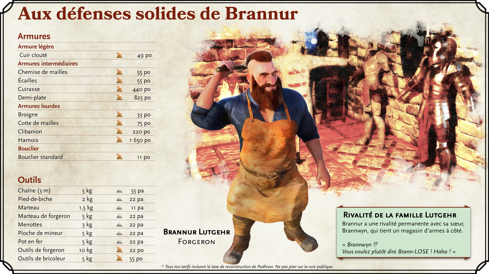
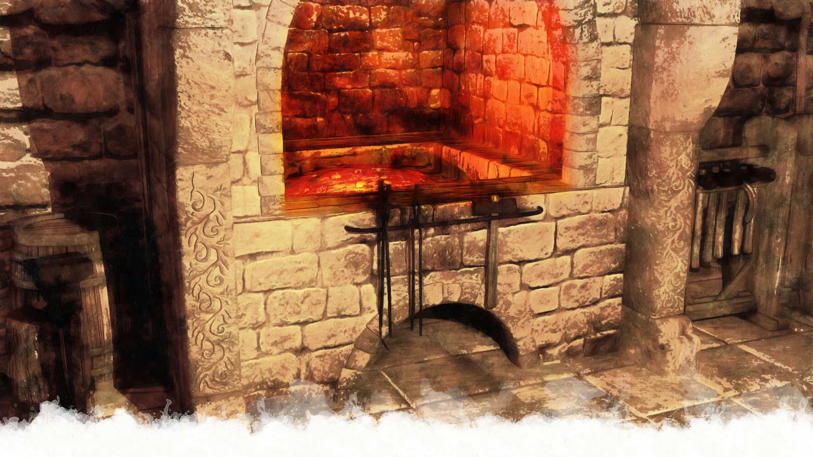
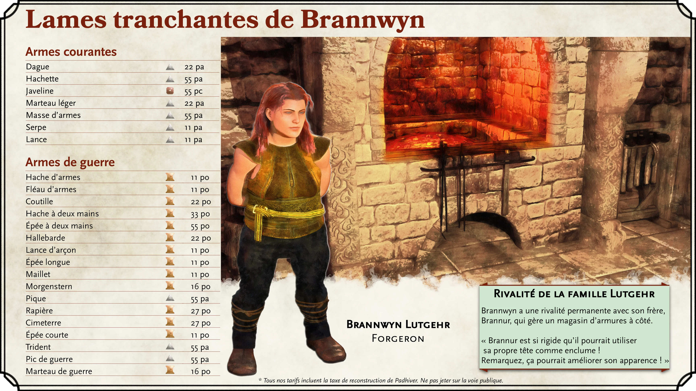
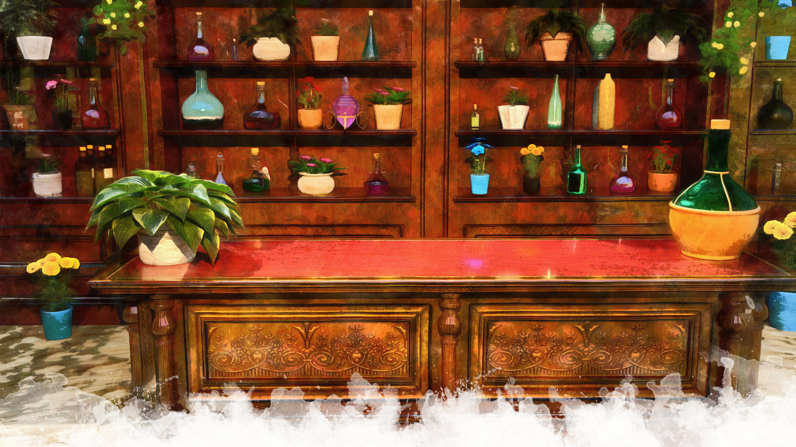
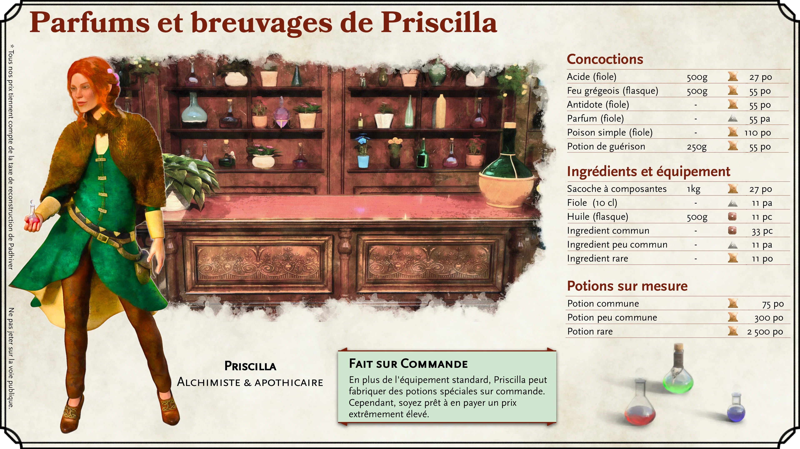
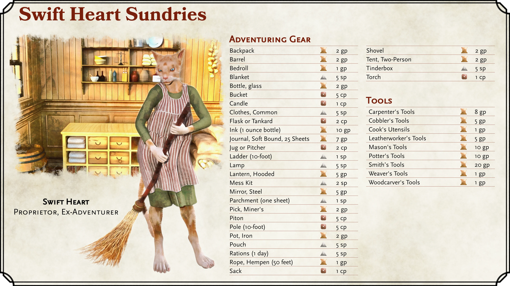
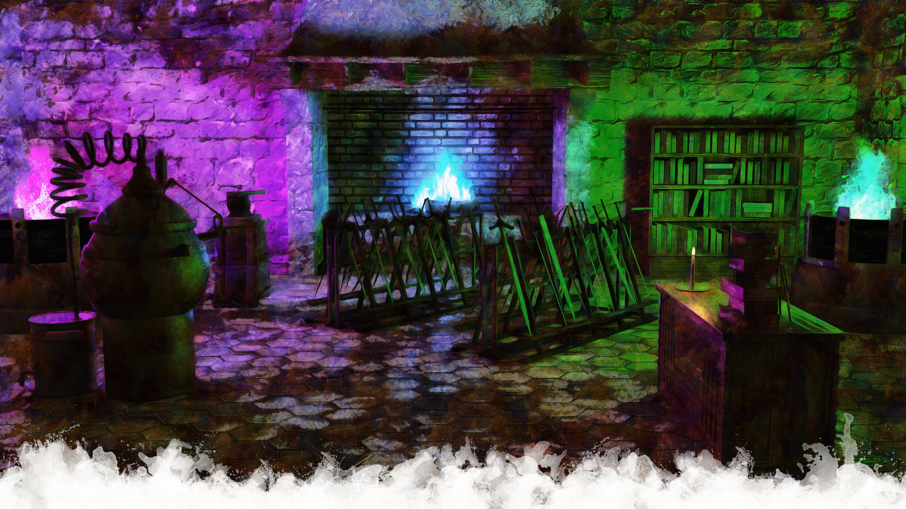
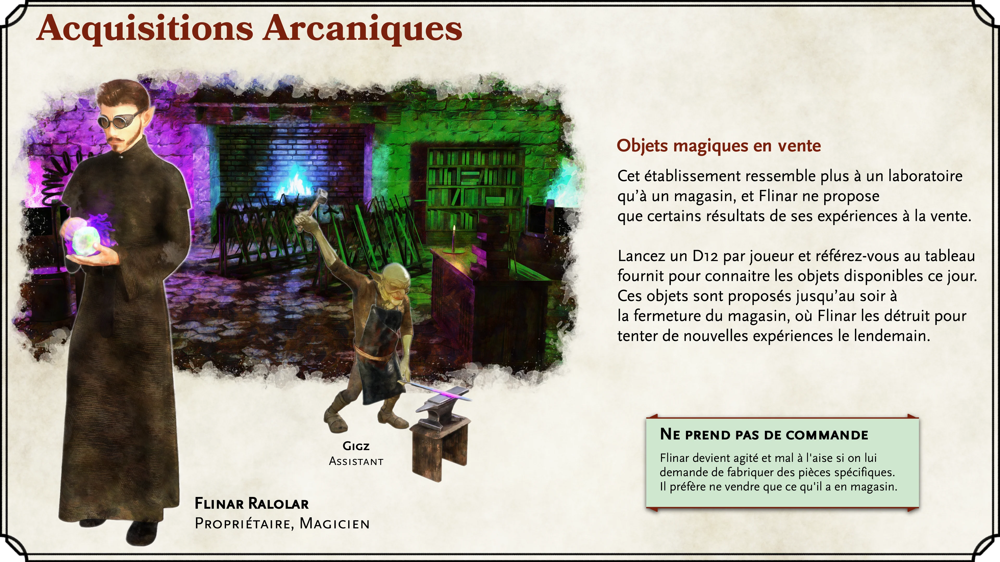

# Lieux "Homebrew"

|**Contenu "Homebrew"**|
|---|
|Cette section présente des lieux non officiels de Padhiver, créés pour ce guide. Personnalisez-les pour *votre* campagne !|
{.homebrew}

Bienvenue, maîtres de donjon ! Alors que ce guide s’est jusqu’à présent concentré sur les lieux officiels et l’histoire de Padhiver, cette section vise à fournir des lieux nouvellement créés que les maîtres de donjon pourraient trouver utiles s’ils mènent une campagne dans cette ville tentaculaire. Malgré les excellents emplacements proposés dans les sources officielles, la ville est en fait peuplée de magasins et d’emplacements utilitaires plus banals (du moins par rapport à d’autres communes comme Phandaline).

Dans cette section, vous trouverez un magasin d’armures, un magasin d’armes, un magasin de potions, un magasin de marchandises générales et un magasin d’objets magiques - toutes sortes de choses que l’on pourrait s’attendre à trouver dans une grande ville de Faerûn. Tout dans cette section a été conçu uniquement pour ce guide, n’ayez donc aucun remord à modifier les détails de ces emplacements pour votre campagne si vous décidez de les utiliser !

Assurez-vous de consulter l’[Annexe B](point-of-interest-cards-page) pour des affichettes des magasins que vous pouvez remettre à vos joueurs lorsqu’ils visitent ces lieux.

{.size-full .screen-only .before-next-page-header}

### Aux défenses solides de Brannur

*Brannur Lutgehr*, un jeune nain mâle talentueux et travailleur (selon les normes naines), a vu une opportunité dans les efforts de reconstruction de Padhiver. *Brannur* a ouvert un atelier de forge au quartier du gouffre de Padhiver pour y vendre des armures, des outils et de plus gros équipements agricoles (par exemple, des charrues). Alors que la boutique naissante n’est encore positionnée que pour offrir les formes d’armures les plus standard, *Brannur* acquiert rapidement une réputation de produits bien conçus et a même signé des contrats de fourniture d’armures aux forces de l’ordre de Padhiver.

La boutique est impeccablement propre et bien organisée. La majeure partie des armures exposées sont poliee avec une finition miroir et toujours disposées dans une configuration parfaitement symétrique sur les murs et les stands de la boutique. Si *Brannur* n’est pas à l’arrière de la boutique en train de travailler avec les forges, on peut le trouver à l’avant de la boutique en train de balayer ou de courir avec un chiffon pour enlever les taches qui auraient pu se retrouver sur l’une de ses œuvres. Un client qui heurte accidentellement l’un des supports d’armure de telle sorte qu’il s’incline légèrement est susceptible de donner à *Brannur* une contraction involontaire.

Brannur a un comportement calme et poli, et la plupart de ses clients auraient du mal à l’imaginer élever la voix, que ce soit dans l’excitation ou la colère. Cela transparaît dans son travail, car *Brannur* aime concentrer ses talents sur la fabrication d’objets de défense et d’utilité plutôt que sur des objets destinés à nuire. Cependant, cette illusion d’un stoïcisme calme serait rapidement dissipée si l’on voyait *Brannur* et sa sœur, Brannwyn, interagir. Lorsque ces deux-là sont dans la même pièce, une vive dispute surgit à coup sûr.

|**Inspiration pour le Maître du Donjon**|
|---|
|***Ingrédient supérieur***. *Brannur* veut faire monter sa boutique en gamme, mais pour ce faire, il a besoin d’un ingrédient rare difficilement accessible. Il a entendu dire que l’ingrédient était en possession des pirates de la Forteresse et aimerait que le groupe le lui en procure.|
|***Métal rare***. Si dans leurs aventures les héros obtiennent du Mithral, de l’adamantium ou même des écailles de dragon, et en apportent suffisament à Brannur, celui-ci pourra leur confectionner une armure avec.|
{.dmidea}

{.print-bottom-right .with-margin}

(print-page)

{.print-only .size-cover .no-margin}

{.size-full .screen-only .before-next-page-header}

### Les Lames tranchantes de Brannwyn

*Brannwyn Lutgehr*, sœur de *Brannur*, est également venue chercher la fortune qu’un Padhiver en évolution rapide pourrait lui offrir. *Brannwyn* a ouvert une boutique à côté de son frère, *Brannur*, où elle expose également ses talents de forgeron en créant toutes sortes d’armes. Comme son frère, *Brannwyn* acquiert également la réputation d’être une source fiable pour armer les forces de défense croissantes de Padhiver. En fait, certains membres du personnel d’approvisionnement de la ville ont irrité à la fois *Brannur* et *Brannwyn* en passant une seule commande d’armures et d’armes, pensant que leurs deux magasins ne forment qu’une seule entité.

La boutique de *Brannwyn* n’a pas la propreté méticuleuse exposée dans la boutique de son frère, mais cela ne signifie pas que les produits sont de moindre qualité. Les armes fabriquées dans la boutique de *Brannwyn* sont forgées avec soin, et elles sont connues pour être aussi fiables que mortelles. Les épées fabriquées dans la boutique de *Brannwyn* sont tranchantes, bien équilibrées et très robustes.

La personnalité de *Brannwyn* est presque l’exact opposée de celle de son frère, et le nom "Lame tranchantes" de sa boutique fait aussi probablement référence à son comportement qu’à ses armes finement conçues. *Brannwyn* est vive d’esprit et n’hésitera pas à prendre un coup verbal à tout ce qui arrive dans sa boutique. Ceux qui sont facilement offensés feraient probablement mieux de faire leurs courses ailleurs.

 **Brannwyn Lutgehr**, Forgeronne
<!--{p:.print-top-right.with-margin.above}-->

> **Rivalité fraternelle**
>
> *Brannur* et *Brannwyn* sont extrêmement compétitifs entre eux, et chacun fera presque n’importe quoi pour surpasser l’autre. Leurs magasins sont situés juste à côté l’un de l’autre, autant dire que les compétitions sont fréquentes. Certains acheteurs habiles ont remarqué qu’ils peuvent utiliser cette rivalité à leur avantage - généralement en montant les frères et sœurs les uns contre les autres. Tout ce qu’il faut généralement, c’est une simple affirmation que l’un a revendiqué pouvoir faire quelque-chose de mieux que l’autre ; cela obligera le premier à travailler très dur ou à réduire les prix simplement pour surclasser l’autre.
>
> Cependant, insulter un des frère et sœur devant l’autre sera accueilli avec fureur. Au fond, ils se soucient profondément l’un de l’autres, et leurs petites querelles sont de loin éclipsées par l’immense sentiment de fierté et d’unité familiale. Il est assez courant de voir l’un aider l’autre en prêtant un outil ou même en faisant don de métaux et de matériaux coûteux. Un étranger faisant une remarque désobligeante envers un des frères et sœurs sera, au mieux, accueilli par un regard noir et une insulte en retour et, au pire, se verra expulser du magasin ou appellera tout le clan Lutgehr aux armes.

(print-page)

{.print-only .size-cover .no-margin}

{.size-full .screen-only .before-next-page-header}

### Parfums et boissons de Priscilla

Parfums et boissons de Priscilla est détenu et exploité par une jeune femme humaine qui s’appelle simplement *Priscilla* - sans nom de famille. La belle boutique, située dans le quartier du Lac Bleu, a des étagères du sol au plafond remplies de fleurs fraîches et de bouteilles en verre de liquides aux couleurs vives. En fait, il y a tellement de fleurs dans cette boutique que plusieurs nouveaux venus l’ont prise pour un fleuriste. Toutes les armoires de la boutique sont richement conçues et polies de manière éclatantes.

Alors que le nom de la boutique peut sembler indiquer qu’elle se concentre sur les parfums et les boissons parfumées, *Priscilla* est une alchimiste et apothicaire extrêmement talentueuse. Elle est capable de faire des concoctions exotiques et rares pour le juste prix. Elle a également un certain talent pour diagnostiquer les maladies, bien qu’elle n’offre généralement pas ces services à moins qu’on ne lui demande explicitement.

Bien qu’extrêmement joviale, *Priscilla* évitera de donner beaucoup d’informations personnelles. Comment elle en est venue à posséder ses compétences à un si jeune âge, comment elle pouvait s’offrir une si belle boutique dans le quartier en vogue du Lac Bleu et son histoire familiale sont toutes mystérieuses. Les voisins du quartier vous diront que la boutique elle-même a semblé surgir de nulle part du jour au lendemain.

(print-column)

Bien qu’elle soit relativement nouvelle dans la ville, *Priscilla* est maintenant bien connue d’un grand nombre d’habitants de Padhiver comme une personne dotée d’une grande compassion. Elle fait fréquemment don de ses biens et services aux résidents les plus pauvres de Padhiver qui en ont vraiment besoin. Elle se rend même régulièrement au quartier du Gouffre pour remettre en main propre des potions et des cataplasmes aux malades ou aux blessés.

Néanmoins, sa boutique correspond parfaitement à la volonté du quartier du Lac Bleu d’être restaurée avec goût. Les résidents les plus riches de Padhiver connaissent tous *Priscilla* et fréquentent sa boutique pour ses potions et ses parfums finement travaillés. Les habitants les plus pauvres de Padhiver ne connaissent peut-être pas la boutique, mais connaîtront absolument *Priscilla* elle-même et ses supposés remèdes "miracles".

{.no-margin .print-bottom-right}

(print-page)

{.size-full .screen-only .before-next-page-header}

### Articles divers de Cœur-Vif

Articles divers de Cœur-Vif est un magasin de marchandises générales appartenant à *Cœur-Vif*, une Tabaxi relativement âgée.
La boutique est un nouveau bâtiment modeste qui a été construit sur les fondations d’un bâtiment effondré dans le quartier du Gouffre.

>  Le bâtiment récemment construit sent le bois frais, la farine fraîche et les herbes séchées suspendues. Les étals sont modestes, mais la boutique est bien rangée.

Cœur-Vif, après une longue vie remplie d’aventures à la recherche de trésors, a utilisé sa petite fortune pour s’installer et prendre sa retraite. Toujours audacieuse, cependant, Cœur-Vif a délibérément choisi de placer sa boutique dans une ville inconnue. Elle a estimé que s’installer dans un nouvel endroit étrange lui procurerait au moins de l’excitation même à la "retraite". Au cours de ses voyages, elle a noué de nombreuses relations avec des fournisseurs et des commerçants, et a supposé qu’elle pourrait utiliser ces relations pour créer une petite boutique rentable. À la nouvelle de la terre presque libre disponible dans le gouffre maintenant scellé de Padhiver, elle se dépêcha de se rendre en ville pour y établir son magasin.

Cœur-Vif a maintenant une disposition détendue et empathique, mais elle sera la première à vous dire qu’elle était une aventurière passionnée dans sa jeunesse. Elle se fera un plaisir de vous raconter une histoire ou deux sur ses randonnées dangereuses à travers des jungles remplies de serpents venimeux géants, des expériences de mort imminente errant dans des dunes désertiques sans fin, ou même des moments passés en haute mer avec son ami capitaine de la marine Tabaxi, *pattes-de-goudron [Stands in Tar]*.

> Oh ! Alors vous êtes des aventuriers ! Figurez-vous que j’ai moi aussi vécu mon lot d’aventure à une époque ! Rechercher des trésors perdus, traverser des jungles remplies de serpents venimeux géants, toute une époque !!
Cœur-Vif prend un air pensif et ses yeux brillent à l’évocation de certains souvenirs.
> En parcourant le monde, j’ai noué des relations avec de nombreux marchands et quand l’heure de ma retraite est arrivée, j’ai naturellement pensé à ouvrir une boutique ^^. Quand j’ai entendu que des terrains devenaient disponible pour une bouchée de pain autour du gouffre fraichement scellé de Padhiver, j’ai tenté ma chance. Et puis, m’installer dans un endroit inconnu me procurerais encore un peu d’excitation, même à la "retraite" :){.read}

Voir la [liste des objets vendus par Coeur-Vif](articles-proposes-par-coeur-vif) en Annexe

<!--
|Article|Prix|Poids|
|---|---|---|
|Obj1|1po|1kg|
{.allow-breaks .shop}
-->

{.print-bottom-right .with-margin}

|**En savoir plus**|
|---|
|*pattes-de-goudron [Stands in Tar]* est le capitaine de la quête "Thunder Cliffs" de *Storm’s Lord Wrath*|
{.references}

(print-page-single-column)

{.print-only .size-cover .no-margin}

{.size-full .screen-only .before-next-page-header}

### Acquisitions arcaniques

Acquisitions arcaniques est une boutique qui vend des armes et armures magiques située dans le quartier du Gouffre.
Le magasin est généralement très facile à localiser, car il émanera généralement une lueur violette, verte ou bleue brillante de l’une de ses nombreuses forges et braseros (au grand dam de ses voisins). En s’approchant de la boutique, un client entendra généralement le martèlement d’un marteau sur l’enclume, le sifflement des soupapes à vapeur libérées des nombreux alambics et engins alchimiques, ou le rugissement de flammes apparemment magiques.

> Il émane de ce magasin une lueur changeante, variant de violet au vert. En s’approchant de la boutique, vous entendez divers martèlements et sifflement. Un voisins lâche un *"On est jamais tranquilles avec un voisin comme Flinar !"*.

La boutique est dirigée par l’excentrique magicien nommé *Flinar Ralolar*. Ce demi-elfe porte une robe et des lunettes de soudeur. Il travaille tranquillement avec un froncement de sourcils perpétuel sur son visage. Son assistant, un gobelin du nom de *Gigz,* effectue la plupart des travaux de forge banals à la boutique. Cependant, les clients n’entendront jamais *Flinar* et *Gigz* converser : Le propriétaire ne communique que par télépathie avec son assistant.

*Flinar Ralolar,* d’âge inconnu, est un individu mystérieux. Pas du genre à fournir beaucoup d’informations, on sait peu de choses sur le sorcier. Ce que certains savent, cependant, c’est qu’avant que *Flinar* n’arrive à Padhiver, il faisait partie des nombreux qui sont venus à la caverne du Ressac de Phandaline pour y étudier la Forge des sorts (une fois qu’elle a été débarrassée des forces malveillantes par les aventuriers).

Flinar n’est pas hostile en soi, juste très plat dans son comportement. Son froncement de sourcils semble être plus un attribut physique de l’homme qu’une indication réelle de son mécontentement. Flinar tentera même de sourire et de saluer chaleureusement les clients qui entrent dans son magasin, bien que l’expression semble généralement maladroite, peu sincère et rebutante. Les tentatives de conversation avec *Gigz* ne se solderont jamais que par des hochements de tête.

(print-page-single-column)

*Flinar* propose une variété d’armes, d’armures et d’objets magiques qu’il fabrique dans son atelier. Il n’accepte généralement pas les commandee, et n’offre que ce qu’il a déjà créé. Certains pensent que le magasin est davantage un laboratoire de recherche pour le sorcier, et il ne choisit de vendre ses produits que pour faire de la place à de nouvelles recherches.

Utilisez le tableau suivant pour les objets magiques qui pourraient être proposés dans la boutique de Flinar :

|[D12](/roll/d12)| Objet magique|
|:---:|:---|
|**1**|[Épée longue en vif-argent](/item/quicksilver-longsword)|
|**2**| [Cotte de mailles activée par la pluie](/item/rain-activated-chain-mail)|
|**3**| [Chapeau de traqueur de cerf](/item/deerstalker-hat)|
|**4**| [Masse de la Dîme](/item/tithing-mace)|
|**5**| [Couperet défensif](/item/defensive-cleaver)|
|**6**| [Arc long extra-léger](/item/extra-light-longbow)|
|**7**| [Bottes de barman](/item/bartenders-boots)|
|**8**| [Armure en cuir aérée](/item/airy-leather-armor)|
|**9**| [Dague enragée](/item/enraged-dagger)|
|**10**| [Boucle d’oreille de Babel](/item/babel-earring)|
|**11**| [Armure du crépuscule](/item/shadowgarb-armor)|
|**12**| [Anneau des échos](/item/ring-of-echoes)|
{.allow-breaks .shop}

La description détaillée de chaque objet se trouve en [Annexe D - Liste d’objets magiques](magical-items-page)

{.print-bottom-right .with-margin}
