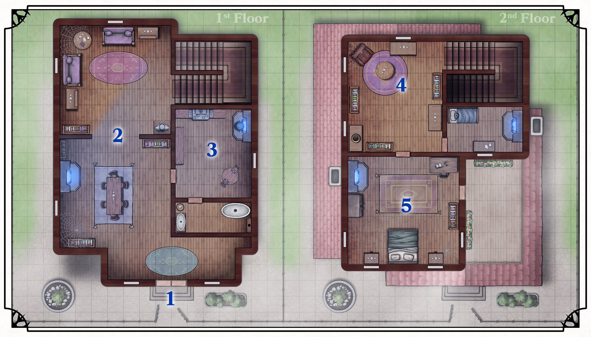

{.size-cover .print-only}

# La Villa abandonnée

|**Contenu "Homebrew"**|
|---|
|Cette section est un lieu non officiel de Padhiver créé pour ce guide. Personnalisez-le pour *votre* campagne !|
{.homebrew}

Cette aventure rapide est conçue pour un groupe d’environ 3 à 5 joueurs de niveau 5.{.no-fancy}

## Mise en scène

Dans le quartier du Lac Bleu de Padhiver se trouve une villa abandonnée qui appartenait au mage de guerre cormyréen *Elden Vargas*. Ce dernier a été en contact avec le culte Ashmadai qui l’ont exploité et ont kidnappé sa femme, l’enfermant à Fort Heaume [Helm’s Hold]. Dans une tentative de sauver sa femme de Fort Heaume, il a utilisé sa magie psychique pour enroler de force de nombreux habitants de Padhiver et attaquer Fort Heaume. *Elden Vargas* et ses actes répugnants ont finalement été arrêtés à Fort Heaume (où des aventuriers héroïques l’ont capturé ou tué), et Vargas n’est jamais retourné dans sa villa.

Avant de partir, *Elden Vargas* a utilisé la magie pour sceller sa villa afin d’empêcher les intrus d’entrer. Cette propriété abandonnée est convoitée depuis longtemps par ceux qui cherchent à revendiquer les domaines abandonnés du quartier du Lac Bleu, mais les protections magiques de la propriété ont, jusqu’à présent, empêché les squatters de prendre la propriété.

Le gang des Rats Morts[Dead Rats], qui opère dans les égouts de Padhiver, surveille la propriété depuis un certain temps. Ils ont récemment enrôlé l’un de leurs mages de Luskan pour briser les protections magiques de la propriété afin de pouvoir revendiquer toutes les reliques magiques qui pourraient s’y trouver.

## Ammorces d’aventure

### Rumeurs de trésors
Les aventuriers entendent parler à la taverne d’un étrange domaine noble abandonné qui n’a pas encore été pillé. Les clients de la taverne supposent qu’il y a des objets magiques rares et quiconque assez courageux pour entrer dans l’endroit serait richement récompensé.

### Missionnés
Les aventuriers sont chargés par un riche marchand de briser la barrière magique empêchant l’entrée dans la maison. Le commerçant aimerait rénover et vendre le domaine, mais ne peut le faire tant que la barrière magique n’est pas supprimée.

(print-page)

## Enquête sur la villa

Lorsque les joueurs approchent de la villa, lisez ce qui suit :

> Une clôture en fer entoure la villa, mais la porte s’ouvre librement. Le vent commence à hurler anormalement et le ciel s’assombrit légèrement avec la couverture nuageuse. La villa, à part le manque d’entretien de certaines plantes, semble être en bon état. Les fenêtres émettent une faible lueur bleue mais sont trop poussiéreuses pour regarder à travers. {.read}

### 1. Extérieur de la villa
||
|---|
|[Rencontre : 2 x Assassins rats-garous, 1 x Mage rat-garou](abandoned-townhouse-wererat-encounter)|
{.enemy .screen-only}

La porte de la villa est verrouillé, toute la maison est protégée par une magie d’abjuration, et les tentatives de percer physiquement une fenêtre ou une porte échoueront (peu importe la force des membres du groupe). La barrière magique, placée par *Elden Vargas*, était destinée à empêcher les voleurs ordinaires d’entrer chez lui pendant son absence. Un simple sort [Dissipation de la magie](/spell/dispel-magic) débarrassera toute la villa de la barrière.

Alors que les joueurs tentent de franchir la porte, trois membres du gang des Rats Morts [Dead Rats] (2 [Assassins rats-garous](/monster/wererat-assassin){.screen-only}[Assassin rat-garou](wererat-assassin-page){ .print-only .monster} et une [Magicienne ratte-garou](/monster/wererat-wizard){.screen-only}[Magicien rat-garou](wererat-wizard-page){.print-only .monster}) approchent par derrière :

> Alors que vous essayez d’entrer dans la structure, trois hybrides mi-homme mi-rat franchissent les portes derrière vous. Deux sont vêtus de cuir noir et portent un assortiment d’épées et de poignards, et un est en robe et porte un bâton lumineux. L’un des rats vêtus de cuir vous gronde : "Vous empiétez sur une propriété des *Rats Morts*, et il serait préférable que vous partiez."{.read}

Le groupe est libre de sortir indemne s’il le souhaite. S’ils choisissent de le faire, la prochaine fois qu’ils reviendront dans la propriété, celle-ci sera saccagée et vide de tous ses objets. Si les aventuriers refusent de partir, les rats-garous attaquent. Si les Assassins rats-garous sont tués en premier, la sorcière tentera de fuir. Celle-ci peut être contrainte de dissiper la barrière magique si elle est capturée vivante.

### 2. Salle à manger et salon

Une étrange flamme bleue scintille dans le foyer mais ne produit aucune chaleur. De vieilles toiles d’araignées tapissent les murs et la poussière s’est déposée sur toutes les surfaces. Un test d’Intelligence (Investigation) DD 15 sur les étagères révélera un [Parchemin de sort de 1er niveau](/item/spell-scroll-1st-level){.magic-item}.

### 3. Cuisine et Sdb

 > La même étrange flamme bleue est dans le foyer de la cuisine. Une casserole d’eau bout sur le foyer. Une porte donne sur une pièce attenante.{.read}

 Malgré le bouillonnement, l’eau est en fait froide au toucher, et la flamme ne produit aucune chaleur. Toute la nourriture dans cette zone est depuis longtemps tombé en poussière. Lorsqu’une créature entre dans la salle de bain attenante à la cuisine, la baignoire se remplit comme par magie d’eau et commence à chauffer.

### 4. Étude

> Cette pièce servait de toute évidence de bureau. Le sol grince et les meubles de l’étage sont recouverts de poussière comme toutes les autres pièces de la maison. Une plante en pot est depuis longtemps morte et fanée. La porte d’une des pièces attenante claque doucement comme si une fenêtre à l’intérieur était restée ouverte.{.read}

La porte qui claque donne sur la chambre d’*Elden Vargas* (section 5). Un test d’Intelligence (Investigation) DD 15 sur les étagères révélera un [Parchemin de sort de niveau 2](/item/spell-scroll-2nd-level).

### 5. Chambre d’*Elden Vargas*

||
|---|
|[Rencontre : 1x Tornade orageuse](abandoned-townhouse-storm-gyre-encounter)|
{.enemy .screen-only}

Elden Vargas a laissé un [Storm Gyre](/monster/storm-gyre){.screen-only}[Storm Gyre](storm-gyre-page){.print-only .monster} dans sa chambre comme sentinelle. Lorsque les joueurs ouvrent la porte de la salle, lisez :

> Au centre de la salle, un vortex tourbillonnant crépite d’arcs de foudre. Le vortex reste stable au centre de la pièce pendant quelques battements de cœur, mais ensuite un visage émerge de la tempête. Un vent chaotique balaie la pièce et fait voler les papiers sur le bureau. Le vortex se précipite sur vous. {.lire}

Le Storm Gyre attaque toutes les créatures à vue et se battra jusqu’à ce qu’il soit détruit. Il n’est pas particulièrement intelligent et attaquera la créature la plus proche. Cependant, si plusieurs créatures sont proches les unes des autres, il tentera d’utiliser son attaque de foudre pour projeter des éclairs à travers plusieurs créatures.

Après avoir vaincu le Storm Gyre, les joueurs qui fouillent dans l’armoire de la chambre trouveront un objet aléatoire de la [Table d’objets magiques B](table-dobjets-magiques-B) du Guide du Maître du Donjon. Épinglé sur un bureau se trouve une note qui se lit :

> Ma très chère *Karis* - Si tu lis ceci, sache que je suis vraiment désolé. - **Elden** {.paper}
