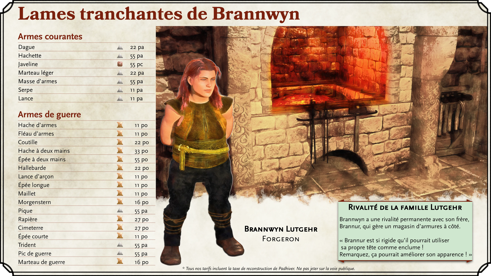

  

{.size-full}

  

{.size-full}

(print-page)

  

{.size-full}

  

{.size-full}

(print-page)

  

{.size-full}

  

{.size-full}

(print-page)

  

{.size-full}

  

{.size-full}

(print-page)

  

{.size-full}
