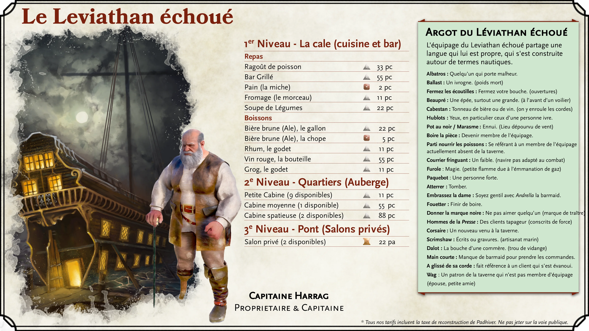
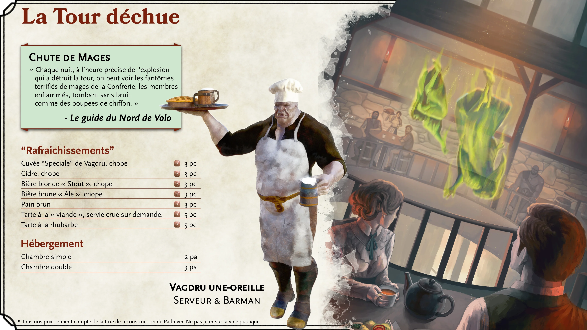
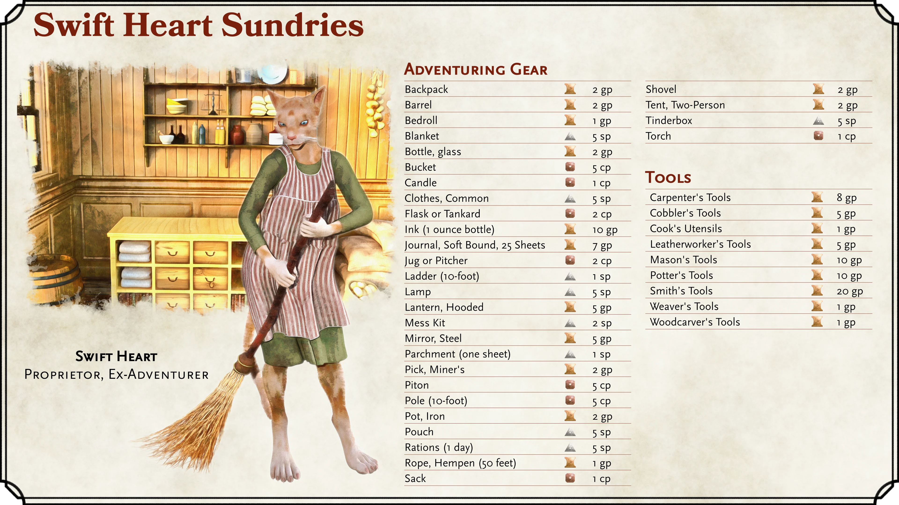

  

{.size-full}

  

{.size-full}

(print-page)

  

{.size-full}

  

{.size-full}

(print-page)

  

{.size-full}

  

{.size-full}

(print-page)

  

{.size-full}

  

{.size-full}

(print-page)

  

# Articles proposés par Cœur-Vif :
|Objet|Prix|Poids|
|---|---|---|
| Équipement d’aventurier||{.shopH1}
|Sacs et contenants||{.shopH2}
|Sac à dos| 22 pa| 2,5 kg|
|Tonneau| 22 pa||
|Bouteille en verre|22 pa|1 kg|
|Seau|6 pc|1 kg|
|Flasque ou chope (50 cl)|3 pc|500 g|
|Cruche ou pichet|3 pc|2 kg|
|Seau|6 pc|1 kg|
|Pot en fer| 22 pa| 5 kg|
|Sacoche| 55 pc| 0,5 kg|
|Sac| 2 pc| 0,25 kg|
|Camping||{.shopH2}
|Sac de couchage| 11 pa| 3,5 kg|
|Couverture| 55 pc| 1,5 kg|
|Gamelle| 22 pc| 0,5 kg|
|Ration (1 journée)| 55 pc| 1 kg|
|Boîte à amadou (allume-feu)| 55 pc| 0,5 kg|
|Tente, deux personnes| 22 pa| 10 kg|
|éclairage||{.shopH2}
|Bougie| 2 pc|  —|
|Lampe|55 pc|500 g|
|Lanterne à capote| 55 pa| 1 kg|
|Lanterne sourde| 11 po| 1 kg|
|Torche| 2 pc| 0,5 kg|
|Divers||{.shopH2}
|Corde en chanvre (15 mètres)| 11 pa| 5 kg|
|Corde en soie (15 mètres)| 11 po| 2,5 kg|
|Miroir en acier| 55 pa| 0,25 kg|
|Parchemin (une feuille)| 11 pc|  —|
|Pioche de mineur| 22 pa| 5 kg|
|Piton| 6 pc| 125 g|
|Perche (3 m)|6 pc|3 kg|
|Pelle| 22 pa| 2,5 kg|
|Habits, courants| 55 pc| 1,5 kg|
|Habits, beaux| 16 po| 3 kg|
|Robe| 11 pa| 2 kg|
|Encre (bouteille de 30 g)| 11 po|  —|
|journal, soft Bound, 25 feuilles| 7 po|  —|
|Échelle (3 m)|11 pc|12,5 kg|
{.shop}

\* Tous les prix indiqués tiennent compte de la taxe de rénovation de Padhiver.

{.size-full}
